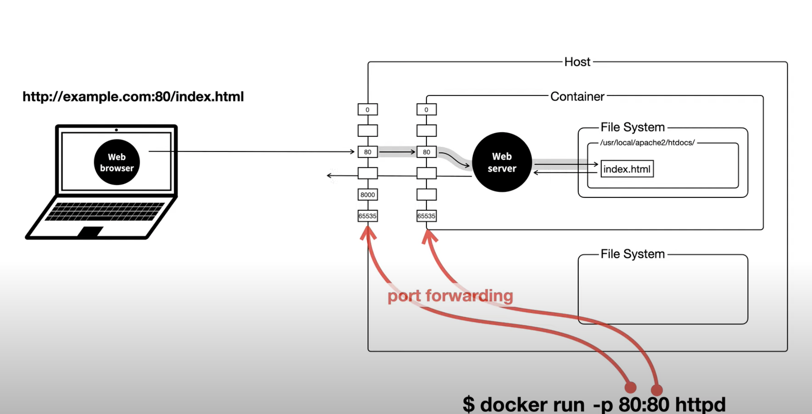
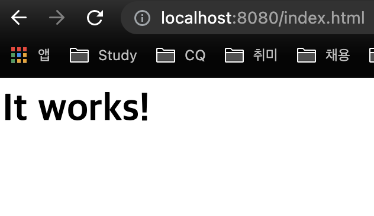

오늘은 다음 협업에서 Git을 제대로 사용해보고자 생활코딩의 지옥 Git,그리고 생코에 최근에 올라와서 보고싶었던 Docker 입문 수업을 보면서 정리를 해본다.

참고 : https://www.youtube.com/watch?v=hFJZwOfme6w&list=PLuHgQVnccGMA8iwZwrGyNXCGy2LAAsTXk&index=1,
https://www.youtube.com/watch?v=EbTJtanJUfE&list=PLuHgQVnccGMDeMJsGq2O-55Ymtx0IdKWf&index=3

오늘은 버전 관리 / branch 정리하고 다음엔 외부 저장소 관리 방법을 정리하면 좋을 것 같다.

---

## Git

### 버전 관리하기

#### 저장소 만들기(init) / 파일 버전관리 등록하기(add)

```bash
[/Users/ijeong-in/Git_repo/gitfth]> # 현재 디렉토리를 새로운 저장소로 지정한다.
[/Users/ijeong-in/Git_repo/gitfth]> git init 
hint: Using 'master' as the name for the initial branch. This default branch name
hint: is subject to change. To configure the initial branch name to use in all
hint: of your new repositories, which will suppress this warning, call:
hint: 
hint: 	git config --global init.defaultBranch <name>
hint: 
hint: Names commonly chosen instead of 'master' are 'main', 'trunk' and
hint: 'development'. The just-created branch can be renamed via this command:
hint: 
hint: 	git branch -m <name>
Initialized empty Git repository in /Users/ijeong-in/Git_repo/gitfth/.git/
[/Users/ijeong-in/Git_repo/gitfth]> # .git 디렉토리가 생긴것을 확인.
[/Users/ijeong-in/Git_repo/gitfth]> ll
total 0
drwxr-xr-x   3 ijeong-in  staff   96  9 22 17:26 .
drwxr-xr-x  15 ijeong-in  staff  480  9 22 17:26 ..
drwxr-xr-x   9 ijeong-in  staff  288  9 22 17:26 .git
[/Users/ijeong-in/Git_repo/gitfth]> vi f1.txt
[/Users/ijeong-in/Git_repo/gitfth]> # git status로 현재 저장소의 상태를 확인할 수 있다.
[/Users/ijeong-in/Git_repo/gitfth]> # 파일을 새로 생성하면 Untracked files 목록에 표시된다.
[/Users/ijeong-in/Git_repo/gitfth]> # Untracked files은 저장소에 있지만 git이 버전관리를 해주지 않는다.
[/Users/ijeong-in/Git_repo/gitfth]> git status
On branch master

No commits yet

Untracked files:
  (use "git add <file>..." to include in what will be committed)
	f1.txt

nothing added to commit but untracked files present (use "git add" to track)

[/Users/ijeong-in/Git_repo/gitfth]> # git add는 git에게 버전관리를 해주도록 등록한다.
[/Users/ijeong-in/Git_repo/gitfth]> git add f1.txt 
[/Users/ijeong-in/Git_repo/gitfth]> # git은 이제 새로운 파일을 new file이라고 인식한다.
[/Users/ijeong-in/Git_repo/gitfth]> git status                             
On branch master

No commits yet

Changes to be committed:
  (use "git rm --cached <file>..." to unstage)
	new file:   f1.txt


```

#### 새로운 버전 만들기(commit)

버전은 모든 변화를 의미하지는 않는다. 유의한 변경에만 버전을 만드는 것이 git을 잘 사용하는 방법중 하나이다.
커밋은 이 버전을 만드는 사람의 정보가 필요하다. (이름, 이메일)

```bash
[/Users/ijeong-in/Git_repo/gitfth]> git config --global user.name rockintuna
[/Users/ijeong-in/Git_repo/gitfth]> git config --global user.email rockintuna@naver.com
[/Users/ijeong-in/Git_repo/gitfth]> 
[/Users/ijeong-in/Git_repo/gitfth]> # 확인
[/Users/ijeong-in/Git_repo/gitfth]> git config --list | grep user                      
user.name=rockintuna
user.email=rockintuna@naver.com
```

모든 커밋에는 메시지가 있다. 메시지에는 변화에 대한 내용, 이유 등 버전을 설명할 수 있는 글을 적는다.
! todo, 회사마다 다르겠지만 커밋 메시지에 대해서 자주 사용되는 규칙이 있을 수도 있으니 다음에 찾아보기

```bash
[/Users/ijeong-in/Git_repo/gitfth]> # 커밋 명령어를 실행하면 메시지를 적을 수 있는 vim창이 켜진다.
[/Users/ijeong-in/Git_repo/gitfth]> git commit
[master (root-commit) 621cb03] 1
 1 file changed, 1 insertion(+)
 create mode 100644 f1.txt
[/Users/ijeong-in/Git_repo/gitfth]> 
[/Users/ijeong-in/Git_repo/gitfth]> # 커밋에 대한 로그 확인하기
[/Users/ijeong-in/Git_repo/gitfth]> git log
commit 621cb038a480e1139a48ed48851cc2809278743e (HEAD -> master)
Author: rockintuna <rockintuna@naver.com>
Date:   Wed Sep 22 17:57:38 2021 +0900

    1

```

파일을 수정해봤다.

```bash
[/Users/ijeong-in/Git_repo/gitfth]> vi f1.txt   
[/Users/ijeong-in/Git_repo/gitfth]> 
[/Users/ijeong-in/Git_repo/gitfth]> # modified에서 수정된 파일을 확인할 수 있다.
[/Users/ijeong-in/Git_repo/gitfth]> git status
On branch master
Changes not staged for commit:
  (use "git add <file>..." to update what will be committed)
  (use "git restore <file>..." to discard changes in working directory)
	modified:   f1.txt

no changes added to commit (use "git add" and/or "git commit -a")
[/Users/ijeong-in/Git_repo/gitfth]> 
[/Users/ijeong-in/Git_repo/gitfth]> # 커밋을 하기전에 add를 하는이유는
[/Users/ijeong-in/Git_repo/gitfth]> # add는 파일을 최초에 버전관리하도록 등록하는 명령어기도 하지만
[/Users/ijeong-in/Git_repo/gitfth]> # 파일이 수정돼서 새로운 버전을 만들기 전에도 커밋보다 먼저 해줘야 한다.
[/Users/ijeong-in/Git_repo/gitfth]> # 즉, 선택적으로 파일을 버전에 포함시킬 수 있게 해준다.
[/Users/ijeong-in/Git_repo/gitfth]> git add f1.txt 
[/Users/ijeong-in/Git_repo/gitfth]> 
[/Users/ijeong-in/Git_repo/gitfth]> git status
On branch master
Changes to be committed:
  (use "git restore --staged <file>..." to unstage)
	modified:   f1.txt

[/Users/ijeong-in/Git_repo/gitfth]> git commit
[master ab7db2c] 2
 1 file changed, 1 insertion(+), 1 deletion(-)
[/Users/ijeong-in/Git_repo/gitfth]> git log
commit ab7db2caa94f8a60eb41474b0449ed342e2e0b88 (HEAD -> master)
Author: rockintuna <rockintuna@naver.com>
Date:   Wed Sep 22 18:05:30 2021 +0900

    2

commit 621cb038a480e1139a48ed48851cc2809278743e
Author: rockintuna <rockintuna@naver.com>
Date:   Wed Sep 22 17:57:38 2021 +0900

    1
```

#### Stage area

선택적으로 파일을 버전에 포함(스테이징)시켜서 적당한 커밋의 시점을 놓쳤을 때 부분적으로 버전을 생성할 수 있도록 할 수 있다.
Stage area : 커밋 대기중인 상태의 파일들

```bash
[/Users/ijeong-in/Git_repo/gitfth]> # 수정된 2개의 파일
[/Users/ijeong-in/Git_repo/gitfth]> git status
On branch master
Changes not staged for commit:
  (use "git add <file>..." to update what will be committed)
  (use "git restore <file>..." to discard changes in working directory)
	modified:   f1.txt
	modified:   f2.txt

no changes added to commit (use "git add" and/or "git commit -a")
[/Users/ijeong-in/Git_repo/gitfth]> # f1.txt만 add하여 커밋 대기상태(스테이지 에어리어)로 놓고, f2.txt는 스테이징 하지 않는다.
[/Users/ijeong-in/Git_repo/gitfth]> git add f1.txt 
[/Users/ijeong-in/Git_repo/gitfth]> git status
On branch master
Changes to be committed:
  (use "git restore --staged <file>..." to unstage)
	modified:   f1.txt

Changes not staged for commit:
  (use "git add <file>..." to update what will be committed)
  (use "git restore <file>..." to discard changes in working directory)
	modified:   f2.txt

[/Users/ijeong-in/Git_repo/gitfth]> git commit
[master cb099ca] 4
 1 file changed, 1 insertion(+), 1 deletion(-)
[/Users/ijeong-in/Git_repo/gitfth]> # 커밋을 했지만 f2.txt는 아직 modified 상태로 남아있다.
[/Users/ijeong-in/Git_repo/gitfth]> git status
On branch master
Changes not staged for commit:
  (use "git add <file>..." to update what will be committed)
  (use "git restore <file>..." to discard changes in working directory)
	modified:   f2.txt

no changes added to commit (use "git add" and/or "git commit -a")
```

#### 변경사항 확인하기(log -p, diff)

- `git log -p` 명령어는 커밋별로 변경사항을 확인할 수 있다.

- `git diff` 명령어는 특정 커밋과 커밋 사이의 변경을 확인할 수 있다. (commit ID 사용)

  ```bash
  > git diff cb099ca51c29a0735b37efca17b0937c7605bd2d..ab7db2caa94f8a60eb41474b0449ed342e2e0b88
  diff --git a/f1.txt b/f1.txt
  index 9462317..2456b16 100644
  --- a/f1.txt
  +++ b/f1.txt
  @@ -1 +1 @@
  -f1.txt : 2
  +source : 2
  diff --git a/f2.txt b/f2.txt
  deleted file mode 100644
  index e2eaf76..0000000
  --- a/f2.txt
  +++ /dev/null
  @@ -1 +0,0 @@
  -source : 1
  ```

  그리고 `git diff`는 파일이 마지막으로 스테이지에 있었던 상태 이후로의 변경을 확인할 수 있다.

  ```bash
  [/Users/ijeong-in/Git_repo/gitfth]> git diff
  diff --git a/f2.txt b/f2.txt
  index e2eaf76..ed48ea0 100644
  --- a/f2.txt
  +++ b/f2.txt
  @@ -1 +1 @@
  -source : 1
  +f2.txt : 2
  ```

#### 과거로 돌아가기(reset, revert)

**reset, revert는 매우 위험한 명령이므로 주의하고 실제로 사용할 때는 더 공부하자**
reset : 해당 커밋 시점으로 돌아가기.
revert : 커밋을 없던일로 하기.

```bash
[/Users/ijeong-in/Git_repo/gitfth]> git reset 35a3ee476330b6f365230a953469c85c9a54dcab --hard
HEAD is now at 35a3ee4 add f2
[/Users/ijeong-in/Git_repo/gitfth]> 
[/Users/ijeong-in/Git_repo/gitfth]> # 해당 시점 이후의 모든 버전이 사라진다.
[/Users/ijeong-in/Git_repo/gitfth]> git log
commit 35a3ee476330b6f365230a953469c85c9a54dcab (HEAD -> master)
Author: rockintuna <rockintuna@naver.com>
Date:   Wed Sep 22 18:07:17 2021 +0900

    add f2

commit ab7db2caa94f8a60eb41474b0449ed342e2e0b88
Author: rockintuna <rockintuna@naver.com>
Date:   Wed Sep 22 18:05:30 2021 +0900

    2

commit 621cb038a480e1139a48ed48851cc2809278743e
Author: rockintuna <rockintuna@naver.com>
Date:   Wed Sep 22 17:57:38 2021 +0900

    1

```

실제로는 완전 버리지는 않고 남아있으니 복구할 수는 있지만 이해가 많이 필요하다.
특히 reset은 원격 리포지토리에 push한 이후의 커밋에는 사용하지 말자.

```bash
[/Users/ijeong-in/Git_repo/gitfth]> git revert 35a3ee476330b6f365230a953469c85c9a54dcab
Removing f2.txt
[master 6c77d4b] Revert "add f2"
 1 file changed, 1 deletion(-)
 delete mode 100644 f2.txt
[/Users/ijeong-in/Git_repo/gitfth]> # revert는 커밋을 취소한 새로운 버전을 만든다.
[/Users/ijeong-in/Git_repo/gitfth]> git log
commit 6c77d4b4b8237c64d0400b8d64777db0f8c95a30 (HEAD -> master)
Author: rockintuna <rockintuna@naver.com>
Date:   Wed Sep 22 18:56:50 2021 +0900

    Revert "add f2"
    
    This reverts commit 35a3ee476330b6f365230a953469c85c9a54dcab.

commit 35a3ee476330b6f365230a953469c85c9a54dcab
Author: rockintuna <rockintuna@naver.com>
Date:   Wed Sep 22 18:07:17 2021 +0900

    add f2

commit ab7db2caa94f8a60eb41474b0449ed342e2e0b88
Author: rockintuna <rockintuna@naver.com>
Date:   Wed Sep 22 18:05:30 2021 +0900

    2

commit 621cb038a480e1139a48ed48851cc2809278743e
Author: rockintuna <rockintuna@naver.com>
Date:   Wed Sep 22 17:57:38 2021 +0900

    1
```


### Git branch

branch는 작업을 분기하는 것을 의미한다. (branch의 수 = 분기의 수)

#### 현재 branch 확인하기

```bash
[/Users/ijeong-in/Git_repo/gitfth]> # 현재 브랜치 확인
[/Users/ijeong-in/Git_repo/gitfth]> # master는 기본 브랜치
[/Users/ijeong-in/Git_repo/gitfth]> git branch
* master
```

#### 새로운 branch 만들기

```bash
[/Users/ijeong-in/Git_repo/gitfth]> # 새로운 브랜치 만들기, 현재 상태를 그대로 가지게 된다.
[/Users/ijeong-in/Git_repo/gitfth]> git branch exp 
[/Users/ijeong-in/Git_repo/gitfth]> git branch    
  exp
* master
[/Users/ijeong-in/Git_repo/gitfth]> # exp 브랜치로 넘어가기
[/Users/ijeong-in/Git_repo/gitfth]> git checkout exp
Switched to branch 'exp'
[/Users/ijeong-in/Git_repo/gitfth]> git branch      
* exp
  master
[/Users/ijeong-in/Git_repo/gitfth]> # 지금은 변경이 없으니 같은 상태이지만  
[/Users/ijeong-in/Git_repo/gitfth]> git log
commit 3e73c78a67ce4a93ebeb8a48159675c837be6e33 (HEAD -> exp, master)
Author: rockintuna <rockintuna@naver.com>
Date:   Wed Sep 22 20:27:44 2021 +0900

    2

commit c44d62959eb87eb77aa50e949a4efddf7c186561
Author: rockintuna <rockintuna@naver.com>
Date:   Wed Sep 22 20:26:48 2021 +0900

    1

[/Users/ijeong-in/Git_repo/gitfth]> git commit -am "3"
[exp de1e8b4] 3
 1 file changed, 2 insertions(+)
[/Users/ijeong-in/Git_repo/gitfth]> 
[/Users/ijeong-in/Git_repo/gitfth]> # 변경이 일어고 커밋된 후에는 서로 다른 상태이다.
[/Users/ijeong-in/Git_repo/gitfth]> git log
commit de1e8b4b24cedc146c6566eb30497c0e5ddc50ba (HEAD -> exp)
Author: rockintuna <rockintuna@naver.com>
Date:   Wed Sep 22 20:36:21 2021 +0900

    3
...
commit c44d62959eb87eb77aa50e949a4efddf7c186561
Author: rockintuna <rockintuna@naver.com>
Date:   Wed Sep 22 20:26:48 2021 +0900

    1

[/Users/ijeong-in/Git_repo/gitfth]> # 다시 master 브랜치로 넘어간다면????
[/Users/ijeong-in/Git_repo/gitfth]> git checkout master
[/Users/ijeong-in/Git_repo/gitfth]> # 수정되기 전으로 돌아간다!!
[/Users/ijeong-in/Git_repo/gitfth]> # 로그뿐만 아니라 실제 파일내용도 바뀌어서 이 부분이 정말정말 신기했다.
[/Users/ijeong-in/Git_repo/gitfth]> git log
commit 3e73c78a67ce4a93ebeb8a48159675c837be6e33 (HEAD -> master)
Author: rockintuna <rockintuna@naver.com>
Date:   Wed Sep 22 20:27:44 2021 +0900

    2

commit c44d62959eb87eb77aa50e949a4efddf7c186561
Author: rockintuna <rockintuna@naver.com>
Date:   Wed Sep 22 20:26:48 2021 +0900

    1

[/Users/ijeong-in/Git_repo/gitfth]> # 브랜치 삭제하기, -d는 merge 후에 가능
[/Users/ijeong-in/Git_repo/gitfth]> git branch -d exp
error: The branch 'exp' is not fully merged.
If you are sure you want to delete it, run 'git branch -D exp'.
[/Users/ijeong-in/Git_repo/gitfth]> 
[/Users/ijeong-in/Git_repo/gitfth]> # 브랜치 삭제하기, -D는 merge 전에도 강제로
[/Users/ijeong-in/Git_repo/gitfth]> git branch -D exp
Deleted branch exp (was de1e8b4).
[/Users/ijeong-in/Git_repo/gitfth]> git branch
* master
```


#### branch 정보 확인하기

```bash
[/Users/ijeong-in/Git_repo/gitfth]> # 각 브랜치 별로 마지막 커밋 시점을 알 수 있다.
[/Users/ijeong-in/Git_repo/gitfth]> # HEAD는 현재 checkout 된 브랜치.
[/Users/ijeong-in/Git_repo/gitfth]> git log           
commit 66573b98ba847df20f967de52d92d4dbc41ccea9 (HEAD -> exp)
Author: rockintuna <rockintuna@naver.com>
Date:   Wed Sep 22 20:56:47 2021 +0900

    4
...

commit c44d62959eb87eb77aa50e949a4efddf7c186561
Author: rockintuna <rockintuna@naver.com>
Date:   Wed Sep 22 20:26:48 2021 +0900

    1
[/Users/ijeong-in/Git_repo/gitfth]> # master 에서 새로운 커밋
[/Users/ijeong-in/Git_repo/gitfth]> git checkout master
Switched to branch 'master'
[/Users/ijeong-in/Git_repo/gitfth]> vi f3.txt
[/Users/ijeong-in/Git_repo/gitfth]> git add f3.txt 
[/Users/ijeong-in/Git_repo/gitfth]> git commit -m "5"
[/Users/ijeong-in/Git_repo/gitfth]> # 이처럼 서로 다른 분기로 갈라졌을때는?
[/Users/ijeong-in/Git_repo/gitfth]> # branches : 모든 브랜치 확인
[/Users/ijeong-in/Git_repo/gitfth]> # graph : 그래프 보여주기
[/Users/ijeong-in/Git_repo/gitfth]> # 여기에서 master와 exp 브랜치의 공통 조상은 2번 버전이다.
[/Users/ijeong-in/Git_repo/gitfth]> git log --branches --graph
* commit 3298904abc450533d3a05503da000fa8d1ac992a (HEAD -> master)
| Author: rockintuna <rockintuna@naver.com>
| Date:   Wed Sep 22 21:00:36 2021 +0900
| 
|     5
|   
| * commit 66573b98ba847df20f967de52d92d4dbc41ccea9 (exp)
| | Author: rockintuna <rockintuna@naver.com>
| | Date:   Wed Sep 22 20:56:47 2021 +0900
| | 
| |     4
| | 
| * commit 1eef21f861ba0654a9a4ea4351441c7942963a6e
|/  Author: rockintuna <rockintuna@naver.com>
|   Date:   Wed Sep 22 20:56:28 2021 +0900
|   
|       3
| 
* commit 3e73c78a67ce4a93ebeb8a48159675c837be6e33
| Author: rockintuna <rockintuna@naver.com>
| Date:   Wed Sep 22 20:27:44 2021 +0900
| 
|     2
| 
* commit c44d62959eb87eb77aa50e949a4efddf7c186561
  Author: rockintuna <rockintuna@naver.com>
  Date:   Wed Sep 22 20:26:48 2021 +0900
  
      1
[/Users/ijeong-in/Git_repo/gitfth]> # 짧게 보기
[/Users/ijeong-in/Git_repo/gitfth]> git log --branches --graph --oneline
* 3298904 (HEAD -> master) 5
| * 66573b9 (exp) 4
| * 1eef21f 3
|/  
* 3e73c78 2
* c44d629 1

```

#### branch 비교하기

```bash
[/Users/ijeong-in/Git_repo/gitfth]> # 브랜치를 비교하는데 기준은 앞, 타깃은 뒤이다. (순서가 중요하다.)
[/Users/ijeong-in/Git_repo/gitfth]> # master에는 없고 exp에는 있는 커밋.
[/Users/ijeong-in/Git_repo/gitfth]> git log master..exp
commit 66573b98ba847df20f967de52d92d4dbc41ccea9 (exp)
Author: rockintuna <rockintuna@naver.com>
Date:   Wed Sep 22 20:56:47 2021 +0900

    4

commit 1eef21f861ba0654a9a4ea4351441c7942963a6e
Author: rockintuna <rockintuna@naver.com>
Date:   Wed Sep 22 20:56:28 2021 +0900

    3

[/Users/ijeong-in/Git_repo/gitfth]> # master에는 없고 exp에는 있는 파일 또는 코드
[/Users/ijeong-in/Git_repo/gitfth]> # 마지막 커밋 시점으로 구분한다.
[/Users/ijeong-in/Git_repo/gitfth]> git diff master..exp
diff --git a/f1.txt b/f1.txt
index 6178079..de98044 100644
--- a/f1.txt
+++ b/f1.txt
@@ -1 +1,3 @@
+a
 b
+c
```

#### branch 병합하기(merge)

```bash
[/Users/ijeong-in/Git_repo/gitfth]> # 먼저 master로 체크아웃해야한다.
[/Users/ijeong-in/Git_repo/gitfth]> git checkout master
Switched to branch 'master'
[/Users/ijeong-in/Git_repo/gitfth]> # exp 브랜치의 변경을 master로 옮기기
[/Users/ijeong-in/Git_repo/gitfth]> git merge exp
Merge made by the 'recursive' strategy.
 f1.txt | 2 ++
 f2.txt | 1 +
 2 files changed, 3 insertions(+)
 create mode 100644 f2.txt
[/Users/ijeong-in/Git_repo/gitfth]> # master 브랜치에 커밋이 찍힌것에 집중.
[/Users/ijeong-in/Git_repo/gitfth]> # 현재 브랜치의 마지막 커밋이 merge할 브랜치의 조상이 아니면 3-way-merge를 사용한다.
[/Users/ijeong-in/Git_repo/gitfth]> # 3-way-merge 방식은 부모가 여러 개인 새로운 커밋을 만든다.
[/Users/ijeong-in/Git_repo/gitfth]> git log --branches --graph --oneline
*   b84c5f5 (HEAD -> master) Merge branch 'exp'
|\  
| * 66573b9 (exp) 4
| * 1eef21f 3
* | 3298904 5
|/  
* 3e73c78 2
* c44d629 1
[/Users/ijeong-in/Git_repo/gitfth]> git branch -d exp
Deleted branch exp (was b84c5f5).
[/Users/ijeong-in/Git_repo/gitfth]> git log --branches --graph --oneline
*   b84c5f5 (HEAD -> master) Merge branch 'exp'
|\  
| * 66573b9 4
| * 1eef21f 3
* | 3298904 5
|/  
* 3e73c78 2
* c44d629 1
```

####   branch 충돌 해결

서로 다른 브랜치에서 같은 파일을 수정한다면?
master, exp 두 브랜치는 서로 같은 조상 커밋이 있다. ( common.txt )

```bash
[/Users/ijeong-in/Git_repo/gitfth]> cat common.txt 
function a(){
}
[/Users/ijeong-in/Git_repo/gitfth]> # master 에서는 기존 코드 위에 추가하고
[/Users/ijeong-in/Git_repo/gitfth]> vi common.txt 
[/Users/ijeong-in/Git_repo/gitfth]> cat common.txt 
function b(){
}
function a(){
}
[/Users/ijeong-in/Git_repo/gitfth]> git commit -am "9"
[master e8663c1] 9
 1 file changed, 2 insertions(+)
[/Users/ijeong-in/Git_repo/gitfth]> git checkout exp
Switched to branch 'exp'
[/Users/ijeong-in/Git_repo/gitfth]> # exp 에서는 기존 코드 아래에 추가했다.
[/Users/ijeong-in/Git_repo/gitfth]> vi common.txt 
[/Users/ijeong-in/Git_repo/gitfth]> cat common.txt 
function a(){
}
function c(){
}
[/Users/ijeong-in/Git_repo/gitfth]> git commit -am "10"
[exp 596d046] 10
 1 file changed, 2 insertions(+)
[/Users/ijeong-in/Git_repo/gitfth]> git checkout master
Switched to branch 'master'
[/Users/ijeong-in/Git_repo/gitfth]> # 난 이게 당연히 막힐줄 알았는데? 잘 된다. 새로운 커밋이 생긴다.
[/Users/ijeong-in/Git_repo/gitfth]> git merge exp
Auto-merging common.txt
Merge made by the 'recursive' strategy.
 common.txt | 2 ++
 1 file changed, 2 insertions(+)
[/Users/ijeong-in/Git_repo/gitfth]> # 파일을 확인하고 매우 놀랐다. 자동으로 합쳐졌다.
[/Users/ijeong-in/Git_repo/gitfth]> cat common.txt 
function b(){
}
function a(){
}
function c(){
}

```

같은 파일의 같은 부분을 수정하면 어떻게 병합해야 할까?

```bash
[/Users/ijeong-in/Git_repo/gitfth]> cat common.txt 
function b(){
}
function a(){
}
function c(){
}
[/Users/ijeong-in/Git_repo/gitfth]> vi common.txt 
[/Users/ijeong-in/Git_repo/gitfth]> cat common.txt 
function b(){
}
function a_master(){
}
function c(){
}
[/Users/ijeong-in/Git_repo/gitfth]> git commit -am "11"
[master dae6b70] 11
 1 file changed, 1 insertion(+), 1 deletion(-)
[/Users/ijeong-in/Git_repo/gitfth]> git checkout exp
Switched to branch 'exp'
[/Users/ijeong-in/Git_repo/gitfth]> vi common.txt 
[/Users/ijeong-in/Git_repo/gitfth]> cat common.txt 
function b(){
}
function a_exp(){
}
function c(){
}
[/Users/ijeong-in/Git_repo/gitfth]> git commit -am "12"
[exp 003d693] 12
 1 file changed, 1 insertion(+), 1 deletion(-)
[/Users/ijeong-in/Git_repo/gitfth]> git checkout master
Switched to branch 'master'
[/Users/ijeong-in/Git_repo/gitfth]> # 이건 예상처럼 병합이 막혀버린다. 어떤 파일이 문제인지 알려준다.
[/Users/ijeong-in/Git_repo/gitfth]> # both modified:   common.txt
[/Users/ijeong-in/Git_repo/gitfth]> git status
On branch master
You have unmerged paths.
  (fix conflicts and run "git commit")
  (use "git merge --abort" to abort the merge)

Unmerged paths:
  (use "git add <file>..." to mark resolution)
	both modified:   common.txt

no changes added to commit (use "git add" and/or "git commit -a")
[/Users/ijeong-in/Git_repo/gitfth]> # Git은 그냥 실패로 넘겨버리지 않고 최대한 병합할 수 있도록 도와준다.
[/Users/ijeong-in/Git_repo/gitfth]> # 여기서는 문제되는 파일에 표시를 해준다.
[/Users/ijeong-in/Git_repo/gitfth]> # "=======" 를 경계로 각 브랜치 부분을 보여준다.
[/Users/ijeong-in/Git_repo/gitfth]> cat common.txt 
function b(){
}
<<<<<<< HEAD
function a_master(){
=======
function a_exp(){
>>>>>>> exp
}
function c(){
}
[/Users/ijeong-in/Git_repo/gitfth]> # 파일을 의도에 맞게 수정한 뒤에 다시 커밋한다.
[/Users/ijeong-in/Git_repo/gitfth]> vi common.txt 
[/Users/ijeong-in/Git_repo/gitfth]> cat common.txt 
function b(){
}
function a_master_exp(){
}
function c(){
}
[/Users/ijeong-in/Git_repo/gitfth]> git add common.txt 
[/Users/ijeong-in/Git_repo/gitfth]> git status 
On branch master
All conflicts fixed but you are still merging.
  (use "git commit" to conclude merge)

Changes to be committed:
	modified:   common.txt

[/Users/ijeong-in/Git_repo/gitfth]> git commit        
[master e94d4ba] Merge branch 'exp'
[/Users/ijeong-in/Git_repo/gitfth]> # 병합 완료!
[/Users/ijeong-in/Git_repo/gitfth]> git log --branches --graph --oneline
*   e94d4ba (HEAD -> master) Merge branch 'exp'
|\  
| * 003d693 (exp) 12
* | dae6b70 11
|/  
*   2bf6ae1 Merge branch 'exp'
|\  
| * 596d046 10
* | e8663c1 9
* | 09d6a13 Merge branch 'exp'
|\| 
| * fa03dd3 8
* | 307d402 Merge branch 'exp'
|\| 
| * 209acef 7
* | 2a8c657 6
|/  
*   b84c5f5 Merge branch 'exp'
|\  
| * 66573b9 4
| * 1eef21f 3
* | 3298904 5
|/  
* 3e73c78 2
* c44d629 1

```

#### stash

다른 브랜치로 checkout을 해야 하는데 아직 현재 브랜치에서 작업이 끝나지 않은 경우에 사용한다. 
stash는 작업중이던 파일을 임시로 저장해두고 현재 브랜치의 상태를 마지막 커밋의 상태로 초기화 할 수 있다. 
그 다음 작업 중이던 브랜치로 복귀하면 이전에 작업하던 내용을 복원할 수 있다.

```bash
[/Users/ijeong-in/Git_repo/gitfth]> git status
On branch exp
Changes not staged for commit:
  (use "git add <file>..." to update what will be committed)
  (use "git restore <file>..." to discard changes in working directory)
	modified:   f1.txt

no changes added to commit (use "git add" and/or "git commit -a")
[/Users/ijeong-in/Git_repo/gitfth]> 
[/Users/ijeong-in/Git_repo/gitfth]> 
[/Users/ijeong-in/Git_repo/gitfth]> git checkout master
M	f1.txt
Switched to branch 'master'
[/Users/ijeong-in/Git_repo/gitfth]> # 브랜치에서 커밋하지 않고 checkout 하면 다른 브랜치에 영향을 준다.
[/Users/ijeong-in/Git_repo/gitfth]> git status
On branch master
Changes not staged for commit:
  (use "git add <file>..." to update what will be committed)
  (use "git restore <file>..." to discard changes in working directory)
	modified:   f1.txt

no changes added to commit (use "git add" and/or "git commit -a")
[/Users/ijeong-in/Git_repo/gitfth]> git checkout exp
M	f1.txt
Switched to branch 'exp'
[/Users/ijeong-in/Git_repo/gitfth]> # 변경 내용 저장하기
[/Users/ijeong-in/Git_repo/gitfth]> # stash는 버전관리가 되고 있는 파일만 변경 내용을 저장한다.
[/Users/ijeong-in/Git_repo/gitfth]> git stash save 
Saved working directory and index state WIP on exp: f531c79 1
[/Users/ijeong-in/Git_repo/gitfth]> # 마지막 커밋 시점으로 초기화 되었다.
[/Users/ijeong-in/Git_repo/gitfth]> git status
On branch exp
nothing to commit, working tree clean
[/Users/ijeong-in/Git_repo/gitfth]> # 저장된 변경 내용 복구하기
[/Users/ijeong-in/Git_repo/gitfth]> # 이 내용은 저장되어있기때문에 reset한 다음에도 다시 복구할 수 있다.
[/Users/ijeong-in/Git_repo/gitfth]> # stash 리스트는 스택 구조이다. 마지막 저장 내용부터 복구한다.
[/Users/ijeong-in/Git_repo/gitfth]> # apply 가 아닌 pop 명령을 사용하면 복구되면서 stash 리스트에서 제거된다.
[/Users/ijeong-in/Git_repo/gitfth]> git stash apply
On branch exp
Changes not staged for commit:
  (use "git add <file>..." to update what will be committed)
  (use "git restore <file>..." to discard changes in working directory)
	modified:   f1.txt

no changes added to commit (use "git add" and/or "git commit -a")


```


---

## Docker

Docker는 가상환경(Container)를 만들고 관리해주는 프로그램이다.

DB가 잘 설치되어있는 환경 또는 웹서버가 잘 설치되어있는 환경을 우리의 PC 또는 서버에 가상환경을 기반하여 실행할 수 있다.
VMware는 이 가상환경에 OS까지 포함하여 제공하는 프로그램이고,
Docker는 가상환경에서 OS를 빼서 좀더 가볍고 빠르게 사용할 수 있도록 해주는 프로그램이다.

### 몇가지 Docker 관련 용어들

- **Docker Hub** : app store 처럼 우리가 필요한 소프트웨어를 찾을 수 있는 서비스
  https://hub.docker.com/search?type=image
- **image** : Docker hub에서 찾아내서 다운받아(**pull** 이라고 한다.) 우리의 컴퓨터에 가지고 있는 것.
- **container** : 현재 실행중인(**running**) image.
- **host** : 컨테이너들을 실행하는 독립된 운영체제

**몇가지 Docker Command-Line 명령어**

```bash
> #도커 허브로부터 이미지 받기
> docker pull httpd
Using default tag: latest
latest: Pulling from library/httpd
a330b6cecb98: Pull complete 
14e3dd65f04d: Pull complete 
fe59ad2e7efe: Pull complete 
68eb42ff9345: Pull complete 
9d5052bb82be: Pull complete 
Digest: sha256:d7c5ce2a3f1c68ae4f0fbf7a08e44bdd3afe80bd294be92645c29f682a24d97c
Status: Downloaded newer image for httpd:latest
docker.io/library/httpd:latest
>
> #이미지 목록
> docker images
REPOSITORY   TAG       IMAGE ID       CREATED       SIZE
httpd        latest    5ebe6e00baf9   9 hours ago   138MB
>
> #이미지 실행하기 (백그라운드 아님!)
> docker run --name ws1 httpd
AH00558: httpd: Could not reliably determine the server's fully qualified domain name, using 172.17.0.2. Set the 'ServerName' directive globally to suppress this message
AH00558: httpd: Could not reliably determine the server's fully qualified domain name, using 172.17.0.2. Set the 'ServerName' directive globally to suppress this message
[Wed Sep 22 05:53:18.393009 2021] [mpm_event:notice] [pid 1:tid 139950647448704] AH00489: Apache/2.4.49 (Unix) configured -- resuming normal operations
[Wed Sep 22 05:53:18.393144 2021] [core:notice] [pid 1:tid 139950647448704] AH00094: Command line: 'httpd -D FOREGROUND'
```

```bash
> # 컨테이너 목록 확인
> docker ps
CONTAINER ID   IMAGE     COMMAND              CREATED         STATUS         PORTS     NAMES
58ef6c61de70   httpd     "httpd-foreground"   2 minutes ago   Up 2 minutes   80/tcp    ws1
>
> # 컨테이너 멈추기 (container ID 또는 name으로 식별)
> docker stop ws1
ws1
> 
> # 컨테이너 stop은 삭제가 아니다.
> # 컨테이너는 아직 남아있다. ps -a 명령어는 중지된 컨테이너까지 확인할 수 있다.
> docker ps -a
CONTAINER ID   IMAGE     COMMAND              CREATED         STATUS                          PORTS     NAMES
58ef6c61de70   httpd     "httpd-foreground"   5 minutes ago   Exited (0) About a minute ago             ws1
> 
> # 중지된 컨테이너 다시 실행하기
> docker start ws1
ws1
>
> # 컨테이너 로그 확인하기
> docker logs ws1
AH00558: httpd: Could not reliably determine the server's fully qualified domain name, using 172.17.0.2. Set the 'ServerName' directive globally to suppress this message
AH00558: httpd: Could not reliably determine the server's fully qualified domain name, using 172.17.0.2. Set the 'ServerName' directive globally to suppress this message
[Wed Sep 22 05:53:18.393009 2021] [mpm_event:notice] [pid 1:tid 139950647448704] AH00489: Apache/2.4.49 (Unix) configured -- resuming normal operations
[Wed Sep 22 05:53:18.393144 2021] [core:notice] [pid 1:tid 139950647448704] AH00094: Command line: 'httpd -D FOREGROUND'
[Wed Sep 22 05:57:08.903669 2021] [mpm_event:notice] [pid 1:tid 139950647448704] AH00492: caught SIGWINCH, shutting down gracefully
AH00558: httpd: Could not reliably determine the server's fully qualified domain name, using 172.17.0.2. Set the 'ServerName' directive globally to suppress this message
AH00558: httpd: Could not reliably determine the server's fully qualified domain name, using 172.17.0.2. Set the 'ServerName' directive globally to suppress this message
[Wed Sep 22 05:58:53.470504 2021] [mpm_event:notice] [pid 1:tid 140556821099648] AH00489: Apache/2.4.49 (Unix) configured -- resuming normal operations
[Wed Sep 22 05:58:53.470626 2021] [core:notice] [pid 1:tid 140556821099648] AH00094: Command line: 'httpd -D FOREGROUND'
> 
> # 실행중이면 컨테이너를 제거할 수 없다.
> docker rm ws1
Error response from daemon: You cannot remove a running container 58ef6c61de707ccc88f5b9a404bb2a967e67aef6e56e0bd7d2ecc4e58ff5d516. Stop the container before attempting removal or force remove
> 
> # 중지한 뒤 컨테이너 제거하기
> docker stop ws1
ws1
> docker rm ws1
ws1
>
> # 이미지 삭제하기
> docker rmi httpd
Untagged: httpd:latest
Untagged: httpd@sha256:d7c5ce2a3f1c68ae4f0fbf7a08e44bdd3afe80bd294be92645c29f682a24d97c
Deleted: sha256:5ebe6e00baf9e77921c66f750839caf2adca3f22595504e4d93154fa5393631a
Deleted: sha256:c8eacd0b7766aa4bab63d1c114ce93be8027fb2a0c88da50b5e09790b0861afd
Deleted: sha256:3f8fa98a529aa40c2e32765a86e8c55c28e5a8dcefff8ee008cf4bd4a1fa543f
Deleted: sha256:ea29852a9e48774c6c7c591f30aed436ac02217cebaad9c3ecb5a1ca0464088c
Deleted: sha256:13b9735276cf2b58a2b658c7236d7db46ccd96d8bd4730d14f91ee337fc1e09b
Deleted: sha256:d000633a56813933cb0ac5ee3246cf7a4c0205db6290018a169d7cb096581046
> docker images   
REPOSITORY   TAG       IMAGE ID   CREATED   SIZE
```

docker 상세 사용법 참고 : https://docs.docker.com/reference/


### 포트 포워딩



Docker의 컨테이너는 외부에서 바로 접근할 수 없다. 그래서 host의 어떤 포트로 요청이 들어오면 어떤 컨테이너의 포트로 연결해줄지를 정해주는 포트 포워딩 작업이 필요하다.

```bash
> # -p는 포트 포워딩 옵션이다.
> # Host의 8080포트로 요청이 들어오면 Container의 80포트로 요청을 전달해준다.
> docker run --name ws2 -p 8080:80 httpd
```



```bash
> # 컨테이너에 명령어 수행하기
> docker exec ws2 ls 
bin
build
cgi-bin
conf
error
htdocs
icons
include
logs
modules
> 
> # 컨테이너의 shell 프로그램 실행하기
> # -i와 -t 옵션을 사용하면 지속적으로 사용할 수 있다.
> docker exec -it ws2 /bin/sh
# 
# ls
bin  build  cgi-bin  conf  error  htdocs  icons  include  logs	modules
# 
# pwd
/usr/local/apache2
# exit
> 

```


### 컨테이너에 Host의 파일시스템 연결하기

호스트에서 파일이 저장되고 수정되기 때문에 안전하고 편하다.

```bash
> 컨테이너 생성할 때 Host의 디렉토리를 컨테이너의 디렉토리에 연결하기
> docker run -p 8888:80 -v /Users/ijeong-in/Desktop/htdocs:/usr/local/apache2/htdocs/ httpd
```

