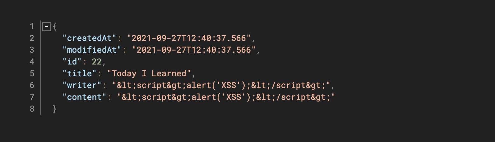

오늘은 스프링 부트에서 XSS, CSRF 공격을 막을 수 있도록 조치해보려고 한다.

참고 : 

- http://homoefficio.github.io/2016/11/21/Spring%EC%97%90%EC%84%9C-JSON%EC%97%90-XSS-%EB%B0%A9%EC%A7%80-%EC%B2%98%EB%A6%AC-%ED%95%98%EA%B8%B0/
- https://jojoldu.tistory.com/470

---

## XSS

 XSS(Cross-Site Scripting) 공격은 권한이 없는 사용자가 웹 사이트에 스크립트를 강제로 삽입하는 공격 기법이다.

참고 : https://noirstar.tistory.com/266

- Persistent XSS
  공격자가 웹 애플리케이션에서 XSS 취약점이 있는 곳을 파악하고 악성스크립트를 삽입하여 데이터베이스에 저장시킨다. 저장된 악성스크립트가 있는 게시글 등을 열람한 사용자들은 악성스크립트가 작동하면서 쿠키를 탈취당한다던가, 혹은 다른 사이트로 리다이렉션 되는 공격을 받게 된다.
- Reflected XSS 
  사용자로부터 입력 받은 값을 다시 되돌려 주는 곳에서 발생한다. (ex. 사용자에게 입력 받은 검색어를 그대로 보여주는 곳) 악성스크립트가 삽입되면, 서버가 사용자의 입력 값을 포함해 응답해 줄 때 악성 스크립트가 실행된다.

XSS 공격을 막기 위해서는 별도의 필터를 사용하여 태그 같은 브라우저가 실행할 수 있는 코드를 문자열로 변경하는 작업을 하거나
XSS를 통한 쿠키 탈취를 막기위해서 쿠키의 httpOnly 속성을 사용할 수 있다.

### **시도 해본 방법**

1. **lucy-xss-servlet-filter**
2. **Spring Security**
3. **MessageConverter**

---

#### lucy-xss-servlet-filter

**lucy-xss-servlet-filter**는 네이버 개발자들이 만든 XSS방어용 서블릿 필터기반 라이브러리이다.
이 라이브러리와 몇차례 씨름을 거쳐 form data 전송 방식에서는 동작하지만, **@RequestBody**로 전달되는 JSON 요청은 처리하지 못한다는 것을 알게되었다. 난 @RequestBody로 Json을 받아 객체로 파싱하므로 이 방법은 결국 패스.

#### Spring Security

https://www.baeldung.com/spring-prevent-xss 
For a regular web application, accessed through a web browser, we can use [Spring Security](https://www.baeldung.com/security-spring)‘s built-in features (Reflected XSS).
이 글을 보고 시큐리티 설정을 해봤는데 난 제대로 동작하지 않는 듯 했다.
잘 만 동작해준다면 이 방법이 제일 편하고 좋은 방법일 것 같다.

#### MessageConverter

요청에서 Json을 받으면 ObjectMapper를 통해 객체로 바꿔주는 녀석이 MappingJackson2HttpMessageConverter이다.
MappingJackson2HttpMessageConverter는 스프링부트가 의존하고 있는 jackson 라이브러리에 있는 컨버터이다.
이 MappingJackson2HttpMessageConverter가 사용하는 ObjectMapper는 JsonFactory라는 객체의 _characterEscapes에 CharacterEscapes를 담고있다. 
기본적으로 _characterEscapes는 null이지만 WebMvcConfigurer를 구현하는 설정 클래스를 통해서 _characterEscapes에 원하는 CharacterEscapes를 세팅할 수 있다.

먼저 xss를 필터링할 커스텀 CharacterEscapes를 만든다. 오명운님이 이미 만든 클래스를 따라 작성했다. (오명운님 코드에서 커스터마이징 부분은 뺐다.)
https://homoefficio.github.io/2016/11/21/Spring%EC%97%90%EC%84%9C-JSON%EC%97%90-XSS-%EB%B0%A9%EC%A7%80-%EC%B2%98%EB%A6%AC-%ED%95%98%EA%B8%B0/

```groovy
implementation 'org.apache.commons:commons-text:1.8'
```

```java
public class HtmlCharacterEscapes extends CharacterEscapes {
    private final int[] asciiEscapes;

    public HtmlCharacterEscapes() {
        this.asciiEscapes = CharacterEscapes.standardAsciiEscapesForJSON();
        this.asciiEscapes['<'] = CharacterEscapes.ESCAPE_CUSTOM;
        this.asciiEscapes['>'] = CharacterEscapes.ESCAPE_CUSTOM;
        this.asciiEscapes['\"'] = CharacterEscapes.ESCAPE_CUSTOM;
        this.asciiEscapes['('] = CharacterEscapes.ESCAPE_CUSTOM;
        this.asciiEscapes[')'] = CharacterEscapes.ESCAPE_CUSTOM;
        this.asciiEscapes['#'] = CharacterEscapes.ESCAPE_CUSTOM;
        this.asciiEscapes['\''] = CharacterEscapes.ESCAPE_CUSTOM;
    }

    @Override
    public int[] getEscapeCodesForAscii() {
        return asciiEscapes;
    }

    @Override
    public SerializableString getEscapeSequence(int ch) {
        return new SerializedString(StringEscapeUtils.escapeHtml4(Character.toString((char) ch)));
    }
}
```

그다음 작성한 CharacterEscapes를 MappingJackson2HttpMessageConverter에 집어넣도록 새로운 설정 클래스를 만들었다.
(스프링 부트에서는 Bean으로 등록된 Converter를 알아서 어플리케이션 컨텍스트의 Converter List에 등록해준다.)

```java
@Configuration
@RequiredArgsConstructor
public class WebMvcConfig implements WebMvcConfigurer {

    private final ObjectMapper objectMapper;

    @Bean
    public HttpMessageConverter<?> htmlEscapingConverter() {
        objectMapper.getFactory().setCharacterEscapes(new HtmlCharacterEscapes());
        return new MappingJackson2HttpMessageConverter(objectMapper);
    }
}
```



동작은 느낌있게 잘한다. 

하지만 한 가지 의문이 남았다.
위의 코드는 xss를 방어하기 위해 기존에 사용하던 ObjectMapper를 어플리케이션 컨텍스트에서 꺼내서 변경한 것인데 이렇게 하면 기존의 MappingJackson2HttpMessageConverter에 있는 objectMapper까지 변경될 것으로 예상되므로 원래 이 컨버터를 사용하던 영역에서 문제가 발생할 수도 있지 않을까.

아마도 jojoldu님은 그걸 생각해서 기존의 ObjectMapper는 그대로 두고 copy()를 통해 사이드 이펙트가 없도록 한 것이 아닐까하는게 나의 생각이다.
https://jojoldu.tistory.com/470
jojoldu님의 포스팅을 읽으면 "진정한 탐구란 이런거다" 라는 느낌마저 든다.

```java
@Configuration
@RequiredArgsConstructor
public class WebMvcConfig implements WebMvcConfigurer {

    private final ObjectMapper objectMapper;

    @Bean
    public HttpMessageConverter<?> htmlEscapingConverter() {
        ObjectMapper copiedObjectMapper = objectMapper.copy();
        copiedObjectMapper.getFactory().setCharacterEscapes(new HtmlCharacterEscapes());
        return new MappingJackson2HttpMessageConverter(copiedObjectMapper);
    }
}
```

좀 더 파해쳐 보고자 AbstractMessageConverterMethodProcessor 클래스의 writeWithMessageConverters 메서드에 있는 `for (HttpMessageConverter<?> converter : this.messageConverters) {` 라인에 디버깅을 해봤다.

위와 같은 설정을 하지 않으면 기본적으로 총 10개 중에서 2개의 MappingJackson2HttpMessageConverter가 등록되는 것을 확인했다.
(이 두가지 MappingJackson2HttpMessageConverter의 차이점을 확인해보려 했는데 사용하는 ObjectMapper에 등록된 ModuleType이 서로 다르다는 것만 확인했고 궁극적으로 어떻게 다른지나 ModuleType에 대한 의미는 아직 모르겠다...)

그리고 설정을 통해 컨버터를 추가하면 새로운 MappingJackson2HttpMessageConverter가 또 하나 생긴다. (총 3개)
여기서 두 가지 갈림길이다.

- ObjectMapper를 copy하지 않으면 예상했던 것 처럼 기존에 있던 MappingJackson2HttpMessageConverter도 같이 변경된 ObjectMapper를 사용하고
- ObjectMapper를 copy하면 기존에 있던 MappingJackson2HttpMessageConverter는 변경되지 않은 ObjectMapper를 사용한다.

스프링에 기본적인 MappingJackson2HttpMessageConverter를 특정해서 사용할 수 있도록하는 내부적인 로직이 있다면 copy는 사이드 이펙트를 줄이는 정말 좋은 방법이다. 
하지만 만약 writeWithMessageConverters에서처럼 for문을 통해 컨버터를 매칭한다면 그냥 먼저 나오는 MappingJackson2HttpMessageConverter가 선택될 것이다. (디버깅에서는 새로 생성한 MappingJackson2HttpMessageConverter가 제일 낮은 index에 있었다.)
어떤 경우든 copy를 해서 적용하는 방법이 사이드 이펙트를 줄일 수 있는 방안이 되므로 나는 copy해서 새로운 ObjectMapper를 만들어서 등록했다.


## CSRF

참고 : https://ko.wikipedia.org/wiki/%EC%82%AC%EC%9D%B4%ED%8A%B8_%EA%B0%84_%EC%9A%94%EC%B2%AD_%EC%9C%84%EC%A1%B0

csrf는 웹 어플리케이션 취약점 중 하나로 공격자가 사용자에게 의도치 않은 요청을 하도록 해서 특정 웹페이지를 보안에 취약하게 한다거나 수정, 삭제 등의 작업을 하게 만드는 공격 방법이다.
csrf 공격은 옥션에서 발생한 개인정보 유출 사건에서도 사용되었다.

XSS 공격이 사용자가 특정 웹사이트를 신용하는 점을 노린 것이라면, 사이트간 요청 위조(csrf)는 특정 웹사이트가 사용자의 브라우저를 신용하는 상태를 노린 것이다. 일단 사용자가 웹사이트에 로그인한 상태에서 사이트간 요청 위조 공격 코드가 삽입된 페이지를 열면, 공격 대상이 되는 웹사이트는 위조된 공격 명령이 믿을 수 있는 사용자로부터 발송된 것으로 판단하게 되어 공격에 노출된다.

토큰의 저장 방식은 쿠키와 localStorage가 있다.
만약 JWT 토큰을 쿠키에 저장한다면 httpOnly 설정을 통해서 XSS 공격에는 안전할 수 있으나 CSRF의 위험에는 노출된 상태라고 볼 수 있다.
공격자는 그냥 사용자에게 요청을 대신 시켜버리는 것이기 때문에 JWT 토큰을 탈취하여 정보를 얻지 않아도 마치 사용자의 요청인 것처럼 위장할 수 있는 것이다.
그렇다고 토큰을 localStorage에 저장하면 XSS의 위험에 노출되어 버린다. localStorage는 간단한 자바스크립트 문장으로 쉽게 꺼내볼 수 있다. 그렇기 때문에 보통 쿠키 저장을 사용한다고 한다.

많은 기술 자료에서는 REST는 stateless를 지향하기에 모든 요청이 독립적이며 서버는 상태 정보를 가지고 있지 않기 때문에 csrf에 대해 어느정도 안전하다고들 말하는데 나는 그 부분이 이해가 되질 않았다.

Spring에서는 CSRF 공격을 막기 위해 Spring Security에 있는 CSRF 프로텍션을 적용할 수 있다.
내일은 이것을 한번 테스트해보자.

