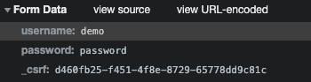

오늘은 어제 공부한 내용을 토대로 스프링 부트에서 CSRF 공격을 막을 수 있도록 적용해보자.

참고 : 


---

## CSRF

참고 : https://ko.wikipedia.org/wiki/%EC%82%AC%EC%9D%B4%ED%8A%B8_%EA%B0%84_%EC%9A%94%EC%B2%AD_%EC%9C%84%EC%A1%B0

어제 JWT 토큰을 저장하는 방식중 쿠키 방식을 사용하면 CSRF 공격에는 노출되는 대신에 XSS 공격으로 인해 토큰이 탈취되는 것을 막을 수 있다고 했다.
쿠키에 저장하면서도 CSRF 공격을 막을 수 있도록 하는 방안은 **Cookie Referer Check** , 그리고 **Csrf Token** 사용을 통해 방지 할 수 있다.

### Cookie Referer Check

Request의 헤더에는 요청에 대한 도메인 정보가 담겨있는 referer가 있는데 referer를 검증하여 CSRF 공격을 차단하는 방식이다.
`@RequestHeader("Referer") String referer`
일반적으로 대부분의 CSRF 공격은 Referer Check를 통해 방어할 수 있다고 한다.

Local에서 내가 만든 GET API에 일반적으로 요청한 referer는 'http://localhost:8080/'
`` 이 html을 보면 요청하는 referer는 'http://localhost:63342/' 이었다.

### CSRF Token

참고 : https://docs.spring.io/spring-security/site/docs/5.2.12.RELEASE/reference/html/protection-against-exploits.html#servlet-csrf-include

CSRF 토큰의 방어 전략은 아래와 같다.
임의의 난수로 만든 토큰(Csrf Token)을 생성해서 세션 저장소에 저장하고 클라이언트에 전달한다.
클라이언트는 중요한 요청(생성, 삭제, 수정)을 서버로 보낼 때 파라미터 또는 헤더에 토큰을 담아서 보내고 서버에서는 해당 토큰이 유효한지 검증을 한다. 
사용자가 CSRF 공격을 당하더라도 CSRF Token은 서버에 전달되지 않으므로 서버는 요청을 수행하지 않는다.

Spring Security는 이 CSRF Token 설정을 Spring MVC 어플리케이션에 손쉽게 설정할 수 있도록 도와준다.
Spring Security는 기본적으로 사용자의 요청 헤더에 CSRF token이 없거나 유효하지 않다면 403 에러를 반환한다.

```groovy
implementation 'org.springframework.boot:spring-boot-starter-security'
```

이를 테스트하기에 앞서 Spring Boot의 Spring Security 관련 자동 설정들을 변경해보자.
Spring Boot의 Spring Security는 자동 설정에 의해 모든 요청이 인증(Authorization)을 요구하게 된다.
또한 기본적으로 인증 가능한 계정 정보(user/generated security password)와 login 페이지를 제공한다.

기본적으로 제공되는 계정은 application.properties에서 변경할 수도 있다.

```properties
spring.security.user.name=demo
spring.security.user.password=password
spring.security.user.roles=ADMIN
```

WebSecurityConfigurerAdapter 타입의 빈을 등록하여 Spring Security관련 설정을 변경할 수 있다.

```java
@Configuration
public class WebSecurityConfig extends WebSecurityConfigurerAdapter {
    @Override
    protected void configure(HttpSecurity http) throws Exception {
      													//모든 페이지에서 인증 요구
        http.authorizeRequests().anyRequest().authenticated().and()
          			//기본 로그인 페이지 사용
                .formLogin().and()
                //HTTP Basic Authentication 사용 (username/password)
                .httpBasic();
    }
}
```

CSRF 방어 설정의 경우에는 사용자가 직접 아래처럼 비활성화 하지 않는다면 기본적으로는 활성화 된다.

```java
.csrf().disable()
```


모든 페이지에서 인증을 요구하므로 GET '/'에서 가져오는 index 페이지만 접속해도 로그인 페이지로 리다이렉트 된다.
여기서 로그인을 마치고 크롬 검사 기능을 사용하면 방금 보낸 로그인 요청에 username 과 password 외에 _csrf 라는 이상한 놈이 들어있다.



스프링 시큐리티의 기본 로그인 페이지는 CSRF 토큰을 요청과 함께 보내도록 미리 세팅되어 있기 때문에 우리가 직접 입력하지 않더라도 된 것이다.
만약 커스텀 로그인 페이지를 만들었다면 CSRF 토큰을 요청에 포함시키는 로직을 구현해야 할 것이다.

이제 POST 요청을 해보자.
GET 요청은 스프링 시큐리티 CSRF 방어 전략에서 기본적으로 배제된다. 아마 GET 요청은 서버의 상태를 변경시키지 않는다고 추측하기 때문이 아닐까. 그래서 GET 요청 같은 경우는 CSRF 토큰 없이도 잘 작동한다.
그러나 POST 요청같은 변경 요청은 CSRF 토큰이 없으면 HTTP 403 status를 반환한다. 


실제 코드에 CSRF를 작성하기 전에 테스트를 한번 해보자.
기존에 있던 나의 테스트는 인증 관련 내용이 없기 때문에 스프링 시큐리티만 의존성에 추가해도 인증을 하지 못해서 실패했다.
스프링은 테스트에 인증 절차를 쉽게 제공할 수 있는 라이브러리를 제공한다.

```groovy
implementation 'org.springframework.security:spring-security-test'
```

spring-security-test는 MVC 테스트에서 인증을 할 수 있는 편한 메서드를 제공한다.
예를 들면 user()와 csrf()가 있다.

```java
mvc.perform(post("/articles")
                        .contentType(MediaType.APPLICATION_JSON)
                        .content(jsonString)
            //user()는 인증할 가짜 계정을 만들어서 인증해준다.
                        .with(user("jilee").roles("USER"))
            //csrf()는 CSRF 방어 인증을 통과해준다.
                        .with(csrf()))
                .andDo(print())
                .andExpect(status().isOk())
                .andExpect(content().contentType(MediaType.APPLICATION_JSON))
                .andExpect(jsonPath("$.title").value("test title 1"))
                .andExpect(jsonPath("$.writer").value("tester"))
                .andExpect(jsonPath("$.content").value("test content 1"));
```

모든 테스트가 인증 처리를 추가로 작성한 후에 정상적으로 통과했다.

그럼 이제부터 실제 요청에 CSRF 토큰을 담아보자.
우선 나는 form 방식의 요청은 없고 ajax를 통한 요청만을 클라이언트에서 처리한다.
form 방식의 경우에는 스프링 시큐리티가 여러 템플릿 엔진과 연동하여 자동으로 input 태그에 넣어주는 기능이 있으므로 어렵지 않을 것이다.
그러나 ajax 요청의 경우에는 조금 더 할 일이 있다.

일단 서버로부터 받는 페이지에 CSRF 토큰을 담아야 한다. 
토큰을 가져올 때는 JSP나 ThymeLeaf 같은 템플릿 엔진을 사용해야 한다.

```groovy
implementation 'org.springframework.boot:spring-boot-starter-thymeleaf'
```

스프링 시큐리티 레퍼런스는 meta 태그에 토큰을 달아둔다. CSRF 토큰은 기본적으로 '_csrf'로 제공되기 때문에 아래처럼 작성할 수 있다.

```html
    <!--  CSRF Token  -->
    <meta name="_csrf" th:content="${_csrf.token}"/>
    <meta name="_csrf_header" th:content="${_csrf.headerName}"/>
```

그 다음 할일은 ajax 요청 헤더에 CSRF 토큰을 담는 것이다. 나는 beforeSend 블록을 사용해서 담았다. 

```javascript
let token = $("meta[name='_csrf']").attr("content");
let header = $("meta[name='_csrf_header']").attr("content");        
```

```javascript
        $.ajax({
            ...
            beforeSend: function(xhr) {
                    xhr.setRequestHeader(header, token);
            },
            ...
        });
```

여기까지 하면 이 ajax 요청은 CSRF 요청을 담고 있기 때문에 서버에서 받아서 잘 처리한다.

사실 여기까지 성공하는데 많이 혼란스러웠는데 원인부터 말하자면 index.html이 static 디렉토리에 있었기 때문이다.
지금까지 템플릿 엔진을 쓰고 있지 않았기 때문에 문제없이 동작했지만 
ThymeLeaf를 사용하여 서버로부터 데이터를 가져올 때는 html이 templates 디렉토리에 있어야한다.
결국 나는 token 과 header 변수가 계속 null 이었던 문제를 찾으려고 꽤 오랜 시간이 걸렸다..

어쨌든 이러저러해서 CSRF 토큰 방식을 공부하고 설정했지만 
이번 과제는 로그인 기능을 만들지 않을거기 때문에 사실 필요 없다. ㅋㅋㅋㅋ
그래도 나름 연구해보고 잘 적용되는걸 확인했기 때문에 만족하고 있다.
