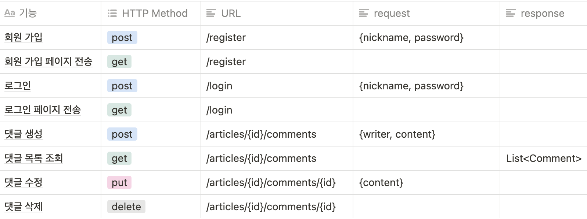

새로운 과제를 받았다 과제에 대한 요구사항을 기획자로부터 받았다고 생각하고 분석해보자.

**Requirement**

- POJO
  - 계정 도메인 모델 추가 {nickname, password}, 회원가입 기능 구현
  - 댓글 도메인 모델 추가 {article, writer, content}, CRUD
- Spring
  - login, authentication
  - 레이어 별 단위 테스트 작성
- Open api
  - kakao 소셜 로그인
- HTML
  - 회원가입 페이지, 로그인 페이지 작성
- API




## Contoller/Service/Repository

- **Controller** : Http 요청을 받거나 돌려주는 역할
- **Service** : 사용자 요구사항을 처리하기 위한 비즈니스 로직
- **Repository** : 데이터베이스에 접근하여 조회나 변경 등 데이터 자원을 처리하는 역할


## IoC/DI

IoC(Inversion of Control) : 프로그램의 제어 흐름이 뒤바뀌는 것을 의미한다.
일반적인 제어의 흐름은 사용자가 필요한 객체를 직접 생성해서 사용한다.

```java
private final ProductRepository productRepository;

    public ProductService(ProductRepository productRepository) {
        this.productRepository = productRepository;
    }
```

IoC의 제어 흐름은 용도에 맞는 이미 생성된 객체를 가져다가 사용한다.
사용할 객체가 어떻게 생성되었는지는 알 수도 없고 알 필요도 없다. (느슨한 결합)

```java
private final ProductRepository productRepository;

public ProductService(ProductRepository productRepository) {
    this.productRepository = productRepository;
}
```

결국 IoC는 인스턴스화 될 때 객체를 집어넣을 생성자가 필요한데, 이때 사용하는 방법이 DI이다.
DI(Dependency Injection, "의존성 주입")는 인스턴스화 될 때 이미 생성되어 있는 객체를 주입하여 의존성을 해결한다.

