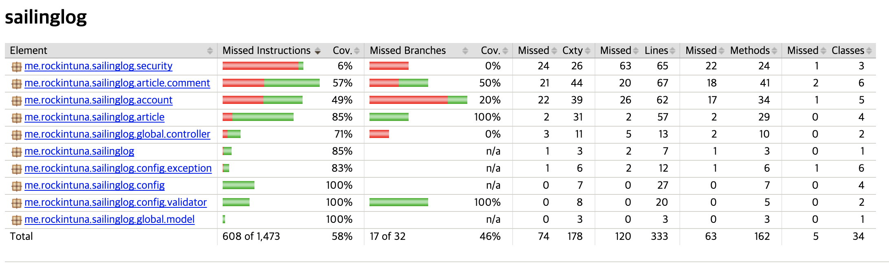

오늘은 과제 마감일이다. 아래 요구사항을 빠르게 적용시켜보자.

1. 게시글 조회 페이지 > 댓글 수정
   - 내가 작성한 댓글만 수정 가능하도록 하기
   - 댓글 본문이 사라지고, 댓글 내용, 저장 버튼 생성하기
   - 댓글 내용에는 이전에 입력했던 댓글 내용을 기본 값으로 채우기
   - 수정할 댓글 내용은 비어 있지 않도록 하기
   - 저장 버튼을 누른 경우 기존 댓글의 내용을 새로 입력한 댓글 내용으로 바꾸기
2. 게시글 조회 페이지 > 댓글 삭제
   - 내가 작성한 댓글만 삭제 가능하도록 하기
   - "정말로 삭제하시겠습니까?" 메세지를 띄우고, 확인/취소 버튼 중 "확인" 버튼을 누른 경우 목록에서 해당 댓글을 삭제하기
   - 취소를 누른 경우 삭제되지 않고 그대로 유지하기


## @ManyToOne Cascade

댓글을 만든 뒤로 게시글 삭제가 안되는 문제가 생겼다.

Cannot delete or update a parent row: a foreign key constraint fails

아마 DB에 delete쿼리까지는 나갔지만 이 게시글 ID를 참조하는 댓글들이 있기 때문인것 같다. 
@ManyToOne으로 되어있어서 참조키가 자동으로 만들어진듯하다.

해결법은 2가지 정도 생각이 났다.

하나는 삭제하기 전에 이 글과 이 글에 연결되어있는 댓글의 연관관계를 끊은 다음 삭제하는 것.
방법은 댓글 객체를 가져와서 `setArticle(null);`하면 되지 않을까 싶다.
근데 나는 세터를 만들기 싫어서 이 방법은 안했다.

두번째는 매핑을 양방향으로 한다음 cascade 옵션을 주는것.
예를 들면 아래와 같다.

```java
    @OneToMany(mappedBy = "article", cascade = CascadeType.ALL)
    @JsonIgnore
    private List<Comment> commentList = new ArrayList<>();
```

일단 JsonIgnore는 왠지 댓글을 가져가는 API에 어마무시한 json 데이터가 날아갈 것 같아서 사용했다..
CascadeType을 사용하면 영속성을 전이시킬 수 있다. 
예를 들면 CascadeType.REMOVE는 이 게시글이 삭제되면 게시글과 연결된 자식 엔티티들도 삭제된다.
세터보다는 이 방식이 더 보기 좋은것 같아서 채택했다.

---

## Jacoco

build.gradle에 Jacoco를 추가하면

```
plugins {
    id 'jacoco'
}
```


gradle로 테스트 커버리지를 확인할 수 있다.
`./gradlew clean test jacocoTestReport`




---

## RestDocs

RestDocs를 시도해보려고 플러그인에 `org.asciidoctor.convert`을 추가해서 하려그러는데 에러가 나서 확인해보니 gradle 버전 7이상부터는 사용할 수 없다고 한다..

그 후 아래 게시글을 참고했는데 너무 도움이 되었다.

https://velog.io/@max9106/Spring-Spring-rest-docs%EB%A5%BC-%EC%9D%B4%EC%9A%A9%ED%95%9C-%EB%AC%B8%EC%84%9C%ED%99%94

asciidoc 작성은 조졸두님 블로그를 참고했다.

https://jojoldu.tistory.com/294

```groovy
plugins {
    id "org.asciidoctor.jvm.convert" version "3.3.2"
}

ext {
    snippetsDir = file('build/generated-snippets')
}

asciidoctor {
    dependsOn test
    inputs.dir snippetsDir
}


bootJar {
    dependsOn asciidoctor
    copy {
        from "${asciidoctor.outputDir}"
        into "src/main/resources/static/docs"
    }
}
```


