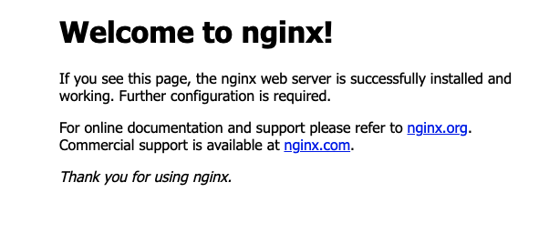

## Nginx

엔진엑스(Nginx)는 Igor Sysoev라는 러시아 개발자가 `동시접속 처리에 특화된` 웹 서버 프로그램이다. `Apache`보다 동작이 단순하고, 전달자 역할만 하기 때문에 동시접속 처리에 특화되어 있다.

#### 1. 정적 파일을 처리하는 HTTP 서버로서의 역할

웹서버의 역할은 HTML, CSS, Javascript, 이미지와 같은 정보를 웹 브라우저(Chrome, Iexplore, Opera, Firefox 등)에 전송하는 역할을 한다. (HTTP 프로토콜을 준수)

#### 2. 응용프로그램 서버에 요청을 보내는 리버스 프록시 역할


클라이언트가 프록시 서버에 요청하고 프록시 서버가 배후 서버(reverse server)로부터 데이터를 가져오는 역할을 한다. 
여기서 프록시 서버가 `Nginx`, 리버스 서버가 `응용프로그램 서버`를 의미한다.

웹 응용프로그램 서버에 리버스 프록시(Nginx)를 두는 이유는 요청(request)에 대한 버퍼링이 있기 때문이다. 클라이언트가 직접 App 서버에 요청하는 경우, 프로세스 1개가 응답 대기 상태가 되어야만 한다. 따라서 프록시 서버를 둠으로써 요청을 `배분`하는 역할을 한다.

### Nginx를 사용하여 무중단 배포하기

#### 시나리오

참고 : https://jojoldu.tistory.com/267

EC2에 Nginx 1대와 스프링부트 jar 2대를 사용할 것이기 때문에 배포를 위해 AWS EC2 인스턴스가 더 필요하지 않는다.


스프링부트1만 Nginx에 연결했다고 가정하고

**배포 전 시나리오**

- 사용자가 주소로 접속 (80, 443 포트)
- Nginx는 사용자의 요청을 받아 현재 연결된 스프링부트(1)로 요청을 전달
- 스프링부트2는 Nginx와 연결된 상태가 아니므로 요청을 받지 않는다.

**배포 중 시나리오**

- 이후에 신규 릴리즈 배포가 필요하다면 스프링부트2로 배포한다.

- Nginx가 여전히 스프링부트1과 연결중이므로 다운타임은 없다.
- 배포가 끝나고 스프링부트2가 정상적으로 구동중인지 확인한 뒤 연결을 변경한다. `nginx reload`
- 이후 들어오는 요청은 스프링부트2로 전달한다. (문제 발생시 스프링부트1로 롤백 가능)


#### 환경 구축 (ubuntu)

Nginx 설치

```bash
$ sudo apt-get install nginx
Reading package lists... Done
Building dependency tree       
Reading state information... Done
The following packages were automatically installed and are no longer required:
  linux-aws-5.4-headers-5.4.0-1054 linux-aws-5.4-headers-5.4.0-1055 linux-aws-5.4-headers-5.4.0-1056
Use 'sudo apt autoremove' to remove them.
The following additional packages will be installed:
  libgd3 libnginx-mod-http-geoip libnginx-mod-http-image-filter libnginx-mod-http-xslt-filter libnginx-mod-mail libnginx-mod-stream libwebp6
  nginx-common nginx-core
Suggested packages:
  libgd-tools fcgiwrap nginx-doc ssl-cert
The following NEW packages will be installed:
  libgd3 libnginx-mod-http-geoip libnginx-mod-http-image-filter libnginx-mod-http-xslt-filter libnginx-mod-mail libnginx-mod-stream libwebp6 nginx
  nginx-common nginx-core
0 upgraded, 10 newly installed, 0 to remove and 43 not upgraded.
Need to get 902 kB of archives.
After this operation, 3019 kB of additional disk space will be used.
Do you want to continue? [Y/n] y
```

설치가 끝나면 Nginx가 실행되어 있다.

```bash
$ ps -ef | grep nginx
root      2490     1  0 18:00 ?        00:00:00 nginx: master process /usr/sbin/nginx -g daemon on; master_process on;
www-data  2493  2490  0 18:00 ?        00:00:00 nginx: worker process
```

Nginx 버전 확인

```bash
$ nginx -V
nginx version: nginx/1.14.0 (Ubuntu)
built with OpenSSL 1.1.1  11 Sep 2018
TLS SNI support enabled
```

이전에 스프링부트로 포워딩 할 때 사용하던 포트 포워딩 해제

```bash
$ sudo iptables -t nat -D PREROUTING -i eth0 -p tcp --dport 80 -j REDIRECT --to-port 8080
$ sudo iptables -t nat -L
Chain PREROUTING (policy ACCEPT)
target     prot opt source               destination         

Chain INPUT (policy ACCEPT)
target     prot opt source               destination         

Chain OUTPUT (policy ACCEPT)
target     prot opt source               destination         

Chain POSTROUTING (policy ACCEPT)
target     prot opt source               destination  
```


브라우저에서 EC2의 80 포트로 접속하면 Nginx 페이지를 확인할 수 있다.



#### Nginx 설정 파일

```bash
$ cd /etc/nginx/
$ ls
conf.d        fastcgi_params  koi-win     modules-available  nginx.conf    scgi_params      sites-enabled  uwsgi_params
fastcgi.conf  koi-utf         mime.types  modules-enabled    proxy_params  sites-available  snippets       win-utf
$ vi nginx.conf 
```

**요청을 인터셉트하고 실제 서버로 전달하도록 설정하기.**
Nginx의  config 파일은 **디렉티브**와 **컨텍스트**로 이루어져 있다.
컨텍스트는 `http {}`와 같이 블록 형태로 구성되며 디렉티브는 이런 컨텍스트들 안 또는 밖에 있는 `;`으로 끝나는 설정 키-값 들이다.
유심히 봐야할 컨텍스트는 웹 트래픽 처리를 담당하는 http 컨텍스트이다.

```bash
http {
				include /etc/nginx/conf.d/*.conf;
        include /etc/nginx/sites-enabled/*;

        server {
                  listen 80;
          				server_name MyHost; #MyHost에는 요청을 받을 도메인을 설정한다.

                  location / {
                              proxy_pass http://localhost:8080;
                	}
                	location /test {
                              proxy_pass http://localhost:8080/show;
                	}
        	}
}
```

**server_name** 디렉티브는 도메인(domains)을 설정한다. 하나의 IP 주소에 대해 여러개의 도메인을 설정할 수도 있다.
**location** 디렉티브는 서버 안의 리소스에 대한 여러 요청을 어떻게 응답해야 할지를 설정한다. 

- location 디렉티브에서 블록이 시작되기 전 나오는 주소는 호스트 주소 뒤에 오는 리터럴 스트링을 매칭한다.
- `/`라고 적으면 모든 `/`요청과 매칭되며, 실제 요청의  `/` 뒤에 오는 스트링은 서버 요청으로 넘겨준다.
  (ex) MyHost/home => http://localhost:8080/home
- 여러  location과 매칭되는 요청이 들어온다면 가장 구체적인 location이 선택된다.
  (ex) MyHost/test => http://localhost:8080/show

Nginx 재시작

```bash
sudo service nginx restart
```

이후로는 80포트 요청이 Nginx 웰컴 페이지 대신 8080 포트에 띄운 나의 어플리케이션으로 리다이렉트 된다.


#### Nginx가 동적으로 Proxy Pass를 변경할 수 있도록 설정하기.

```bash
include /etc/nginx/conf.d/service-url.inc;
```

**include 디렉티브**는 외부 파일을 참조한다. 
즉 위의 문장은 /etc/nginx/conf.d/service-url.inc 파일을 참조하여 해당 파일의 내용을 가져올 수 있다.
예를들어 /etc/nginx/conf.d/service-url.inc 파일에서 아래와 같이 변수를 설정하면 include 디렉티브가 있는 **영역**에서 해당 변수를 사용할 수 있다.

```
set $service_set http://app1;
```


**upstream 컨텍스트**는 여러 서버에 요청을 분산시킬 때 설정하는 로드밸런싱 컨텍스트이다.
예를들어 아래와 같이 두 개의 server 디렉티브를 하나의 upstream 컨텍스트에 담으면,
Nginx는 들어오는 요청을 분산시킨다. (분산 기준은 기본적으로는 Round-Robin 방식이다.)

```
upstream app1 {
		server 192.168.0.1:8080;
		server 192.168.0.2:8080;
		keepalive 32;
}
```

일단 로드밸런싱은 제외하고 하나의 서버에 두 개의 스프링을 다른 포트로 띄워서 
Nginx가 어느 포트의 스프링을 사용할 것인지 선택하도록 설정해보자.

```bash
	upstream app1 {
		server 127.0.0.1:8080;
		keepalive 32;
	}
	upstream app2 {
		server 127.0.0.1:8082;
		keepalive 32;
	}
	server {
		include /etc/nginx/conf.d/service-url.inc;
		listen 80;
		server_name MyHost;
		location / {
			proxy_pass $service_url;
		}
	}
```

```bash
vi /etc/nginx/conf.d/service-url.inc
```

```bash
set $service_url http://127.0.0.1:8080;
```

이제부터는 Nginx가 /etc/nginx/conf.d/service-url.inc 파일의 $service_url 변수를 읽어서 프록시 패스에 입력한다.
즉, /etc/nginx/conf.d/service-url.inc 파일의 내용에 따라 동적으로 프록시 패스를 변경할 수 있다.

일반적으로는 아래와 같은 쉘스크립트를 사용하여 변경하는 것 같다.

```bash
#!/usr/bin/env bash

 echo "> 전환할 Port: $IDLE_PORT"
 echo "> Port 전환"
 echo "set \$service_url http://127.0.0.1:${IDLE_PORT};" | sudo tee /etc/nginx/conf.d/service-url.inc

 echo "> 엔진엑스 Reload"
 sudo service nginx reload
}
```

스크립트에 health-check, 스프링 재기동, profile과 port 체크 로직을 추가하면 무중단 배포 시스템을 구축할 수 있다.


### Spring Active Profile

Spring은 profile이라는 개념을 통해서 어플리케이션 실행 시 특정 @Component, @Configuration, properties 파일 사용 여부를 선택할 수 있다.
무중단 배포 관점에서는 profile을 통해서 사용하는 properties를 구분하여 profile에 따라서 서로 다른 port를 사용하도록 할 수 있다.

Spring Boot는 매우 편리하게도 properties 파일의 이름으로 구분할 수 있다.
예를들면 dev profile은 자동으로 application.properties 대신 application-dev.properties를 사용하게 된다.
(만약 이름에 맞는 properties 파일이 없다면 기본 properties 파일인 application.properties를 사용한다.)

application-app1.properties를 만들고 아래와 같이 추가하면 app1 profile로 실행된 어플리케이션은 기본 포트인 8080 대신 8081을 사용하게 된다.
기동시 profile 설정은 `-Dspring.profiles.active=app1` 와 같이 실행 명령어에 추가한다.

```properties
server.port=8081
```

로그에서는 특정 프로파일을 사용했다는 것과 포트가 변경된 것을 확인할 수 있다.

```bash
The following profiles are active: app1
```

```bash
Tomcat initialized with port(s): 8081 (http)
```

이런 식으로 두 가지 profile 및 properties 파일을 생성해두면, 실행시점에 profile을 통해서 포트를 선택할 수 있다.

**프로파일 확인 핸들러 추가**

```java
    private final Environment env;

    @GetMapping("/profile")
    public String getProfile () {
        return Arrays.stream(env.getActiveProfiles())
                .findFirst()
                .orElse("");
    }
```


### Spring Actuator

**애플리케이션의 상태**를 종합적으로 정리하여 제공해주는 라이브러리.

의존성 추가

```groovy
implementation 'org.springframework.boot:spring-boot-starter-actuator'
```

의존성을 추가한다음 GET '/actuator/health' 요청을 보내면 어플리케이션이 정상적으로 구동중인 경우에 아래와 같은 결과를 받을 수 있다.

```json
{
    "status": "UP"
}
```


```bash
#!/bin/bash
BASE_PATH=/home/ubuntu/habitMonster
BUILD_PATH=$(ls $BASE_PATH/*.jar)
JAR_NAME=$(basename $BUILD_PATH)
echo "> build 파일명: $JAR_NAME"

echo "> build 파일 복사"
DEPLOY_PATH=$BASE_PATH/jar/
cp $BUILD_PATH $DEPLOY_PATH

echo "> 현재 구동중인 App 확인"
CURRENT_PROFILE=$(curl -s http://localhost/profile)
echo "> Current Profile: $CURRENT_PROFILE"

# 쉬고 있는 app 찾기: app1이 사용중이면 app2가 쉬고 있고, 반대면 app1이 쉬고 있음
if [ $CURRENT_PROFILE == app1 ]
then
  IDLE_PROFILE=app2
  IDLE_PORT=8082
elif [ $CURRENT_PROFILE == app2 ]
then
  IDLE_PROFILE=app1
  IDLE_PORT=8081
else
  echo "> 일치하는 Profile이 없습니다. Profile: $CURRENT_PROFILE"
  echo "> set1을 할당합니다. IDLE_PROFILE: set1"
  IDLE_PROFILE=set1
  IDLE_PORT=8081
fi

echo "> application.jar 교체"
IDLE_APPLICATION=$IDLE_PROFILE-springboot-webservice.jar
IDLE_APPLICATION_PATH=$DEPLOY_PATH$IDLE_APPLICATION

ln -Tfs $DEPLOY_PATH$JAR_NAME $IDLE_APPLICATION_PATH

echo "> $IDLE_PROFILE 에서 구동중인 애플리케이션 pid 확인"
IDLE_PID=$(pgrep -f $IDLE_APPLICATION)

if [ -z $IDLE_PID ]
then
  echo "> 현재 구동중인 애플리케이션이 없으므로 종료하지 않습니다."
else
  echo "> kill -15 $IDLE_PID"
  kill -15 $IDLE_PID
  sleep 5
fi

echo "> $IDLE_PROFILE 실행"
nohup java -jar -Dspring.profiles.active=$IDLE_PROFILE $IDLE_APPLICATION_PATH &

echo "> $IDLE_PROFILE 10초 후 Health check 시작"
echo "> curl -s http://localhost:$IDLE_PORT/actuator/health"
sleep 10

for retry_count in {1..10}
do
  response=$(curl -s http://localhost:$IDLE_PORT/actuator/health)
  up_count=$(echo $response | grep 'UP' | wc -l)

  if [ $up_count -ge 1 ]
  then # $up_count >= 1 ("UP" 문자열이 있는지 검증)
      echo "> Health check 성공"
      break
  else
      echo "> Health check의 응답을 알 수 없거나 혹은 status가 UP이 아닙니다."
      echo "> Health check: ${response}"
  fi

  if [ $retry_count -eq 10 ]
  then
    echo "> Health check 실패. "
    echo "> Nginx에 연결하지 않고 배포를 종료합니다."
    exit 1
  fi

  echo "> Health check 연결 실패. 재시도..."
  sleep 10
done


```


---

#### 문제 해결

**include 디렉티브 위치**

처음엔 기본 nginx.conf 파일에서 아래와 같이 다른 include 디렉티브들이 있는 곳 밑에 새로운 include 디렉티브를 넣었다.

```bash
	include /etc/nginx/conf.d/*.conf;
	include /etc/nginx/sites-enabled/*;
	include /etc/nginx/conf.d/service-url.inc;
```

```
$ cat conf.d/service-url.inc 
set $service_set http://app1;
```

Nginx는 아래와 같은 에러 내용과 함께 실행되지 않았다.

```bash
nginx: [emerg] "set" directive is not allowed here in /etc/nginx/conf.d/service-set.inc:1
```

새로운 버전 문법이 바뀐건지 오타가있는건지 계속 찾다가 알아낸것은 include 디렉티브의 위치가 중요하다는 것.
즉, include 디렉티브가 위치한 영역에서 set 디렉티브가 존재하는 것 처럼 동작하는 것이다.
set 디렉티브는 http 컨텍스트에서 사용할 수 없고 server 컨텍스트에서 사용할 수 있기 때문에
include 디렉티브의 위치를 server 컨텍스트 내부로 옮겨주었다.

```bash
	server {
		include /etc/nginx/conf.d/service-url.inc;
		listen 80;
		server_name MyHost;
		location / {
			proxy_pass $service_set;
		}
	}
```


**테스트에 프로파일 적용하기**

```java
@SpringBootTest(webEnvironment = SpringBootTest.WebEnvironment.RANDOM_PORT)
@ActiveProfiles("test")
class AppInfoControllerTest {
}
```

통계에 완료된거 안나옴 (0시에 스케줄러가 도니까),
몬스터 선택에서 isFirstLogin false로 변경 => 몬스터 선택, 몬스터 교체 API따로 파기
사진은 버킷 사용!
