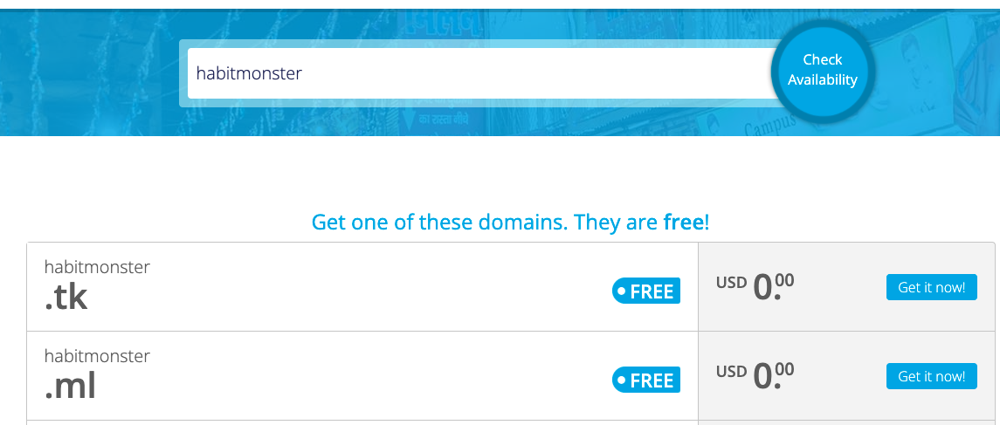
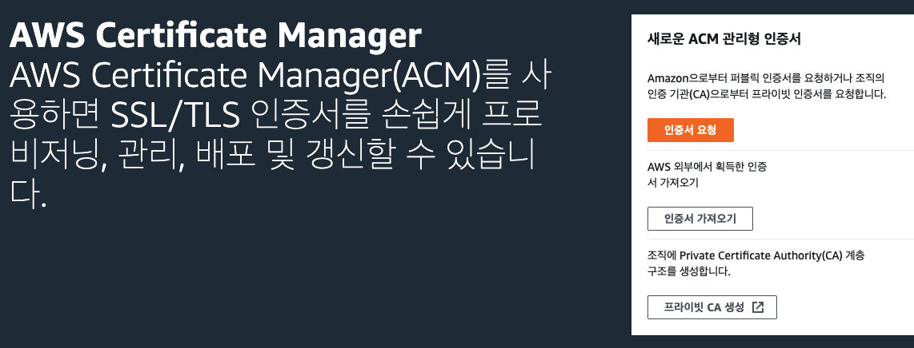
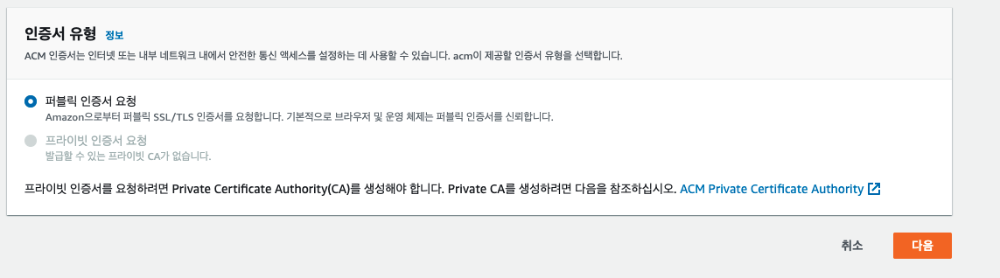
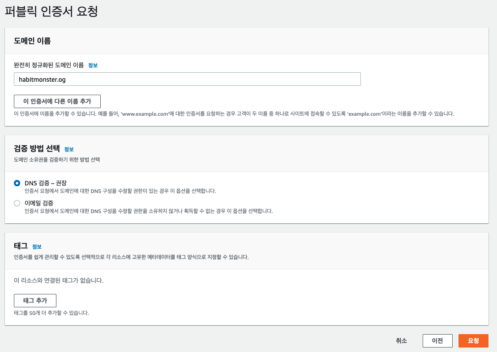
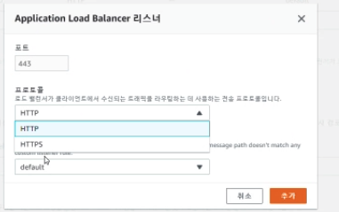
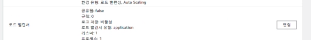

## 오늘의 삽질

### Elastic BeansTalk에서 HTTPS 적용하기

1. **freenom에서 무료로 1년간 사용할 수 있는 도메인 구매하기**
   Get it now!로 진행하다보면 자연스럽게 회원가입이 진행된다.

2. **ACM에서 SSL 인증서 신청하기**

**인증서 요청하기 클릭**

**퍼블릭 인증서 요청**

**도메인 이름 입력하고 DNS로 검증하기 설정**

