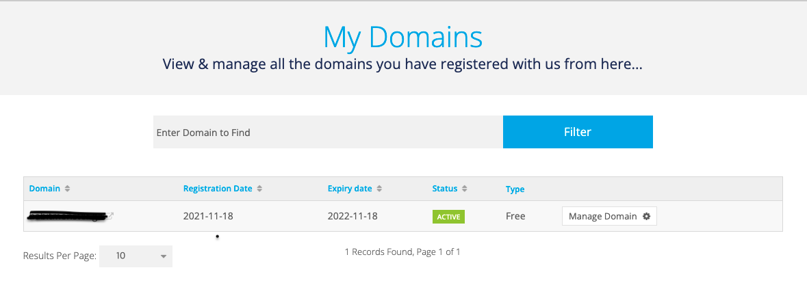
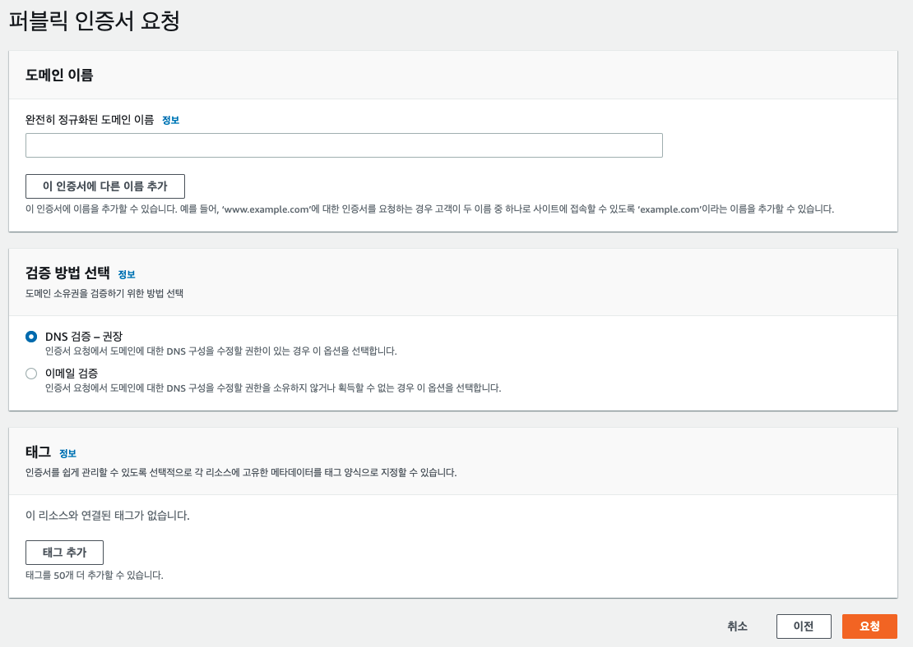
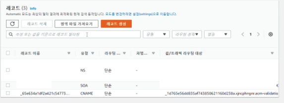
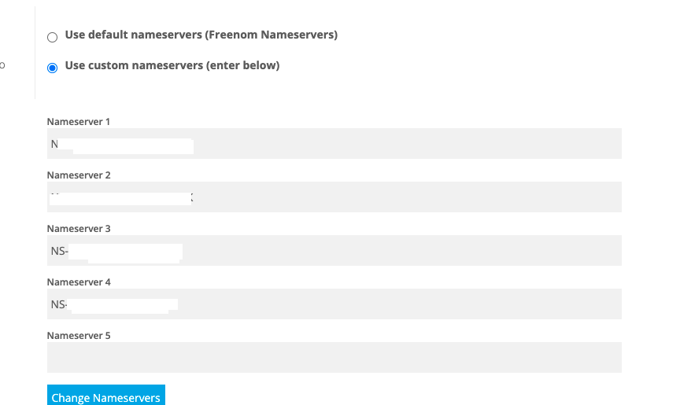
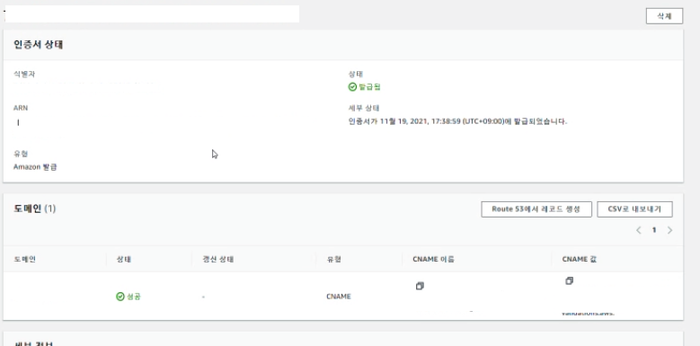
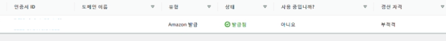

## 오늘의 삽질

### Elastic BeansTalk에서 HTTPS 적용하기

1. **freenom에서 무료로 1년간 사용할 수 있는 도메인 구매하기**
   Get it now!로 진행하다보면 자연스럽게 회원가입이 진행된다.




2. **ACM에서 SSL 인증서 신청하기**

**인증서 요청하기 클릭**


**퍼블릭 인증서 요청**


**도메인 이름 입력하고 DNS로 검증하기 설정**















유지보수

추천사용자 조회

리팩터링 TESTDATA

EB에 SSL 적용 DB

Pull Request

QueryDSL로 통계 쿼리 짜기


YeHRtbi6XaxRcpgd80HVg5G9n7CGnok7g6QXgrfetDARgNPsi5GG6YKPxYZgZBfxGPYziVTjO65BShkSWMLs4A==

```
//Notice Board
    NoticeVo noticeVo1 =  NoticeVo.builder().title("정식런칭 소개").build();

    Notice notice = Notice.create(noticeVo1);
    noticeRepository.save(notice);

    NoticeVo noticeVo2 =  NoticeVo.builder().title("피드백 이벤트").build();

    Notice notice2 =  Notice.create(noticeVo2);
    noticeRepository.save(notice2);


}
```


```
Water(makePreSet("water")), WorkOut(makePreSet("workOut")),
Laugh(makePreSet("laugh")), Meditation(makePreSet("meditation")),
ReadBook(makePreSet("readBook")), Climbing(makePreSet("climbing")),
WashingDishes(makePreSet("washingDishes")), Wash(makePreSet("wash")),
English(makePreSet("english")), Math(makePreSet("math")),
Friend(makePreSet("friend")), Filial(makePreSet("filial")),
Lol(makePreSet("lol")), Mung(makePreSet("mung"));
```

