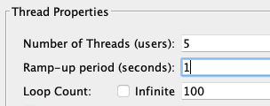
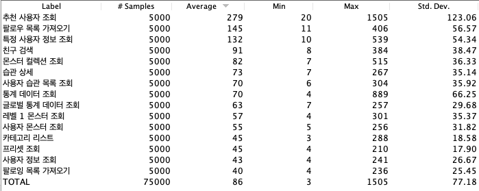
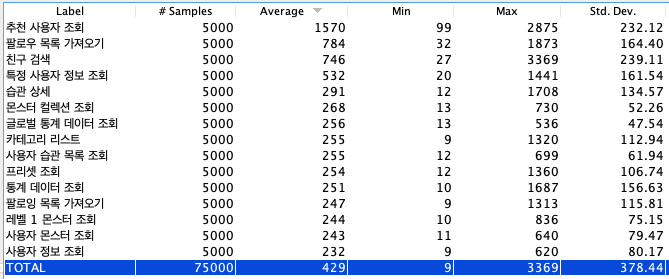
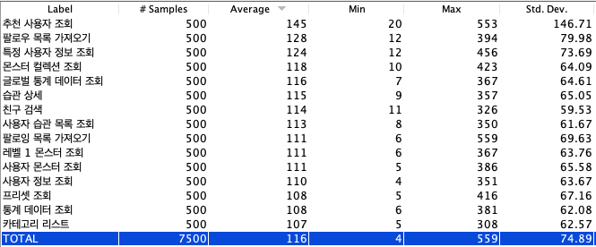
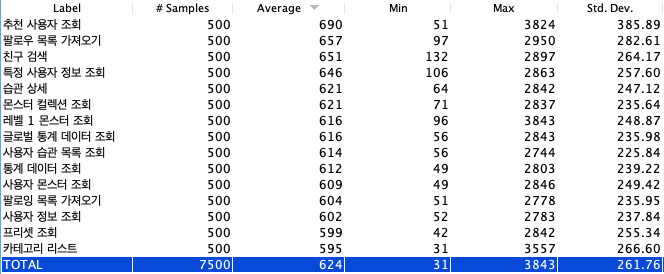
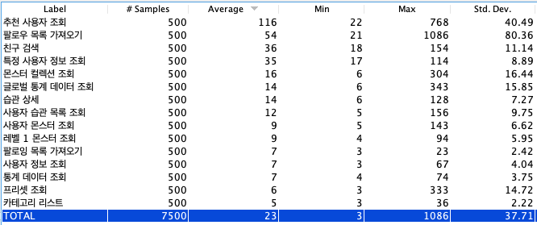
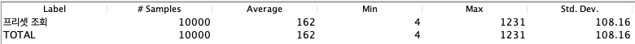
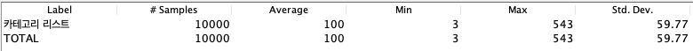
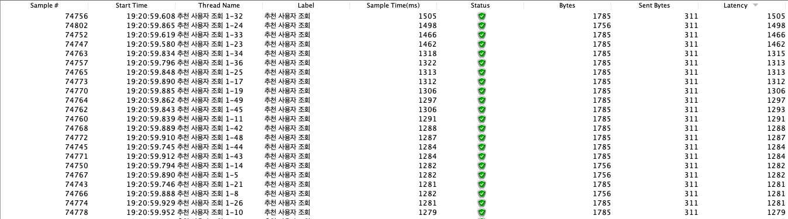

## Jmeter 부하 테스트

Jmeter로 HTTP 테스트를 하면서 두 가지 리스너를 통해서 성능 정보를 추출했다.
참고 : https://kamang-it.tistory.com/398

모든 요청은 아래와 같은 Thread 설정을 통해 실행된다.



- **Number of Threads** : 쓰레드를 동시에 몇개 생성할지이다. 즉 동시에 몇개의 트랜잭션을 실행시킬지이다.
  이는 사람이 동시에 접속하는 효과를 낸다. 10명이서 동시에 접속하는 상황을 만들고 싶다면 10을 사용하면 된다.
- **Ramp-Up Period** : 쓰레드를 Ramp-Up Period시간동안 실행해라는 의미이다. 단 균등하게 시간을 나눠서 실행하려고 노력한다. 예를 들어 Nomber of Threads가 10인데 Ramp-Up Period가 60이면 10개의 쓰레드가 6초간격으로 동작하려고 한다. 근데 그렇게 안될 수도 있다.
- **Loop Count** : 스레드의 반복 횟수를 의미한다. 10이면 10번 반복한다. Infinite에 체크하면 무한 반복한다.


**Summary Report**

설정한 Http Request 별로 성능 데이터를 요약한다.

- 50개 유저에서 개별 HTTP 요청 100번 씩



- 사용자 10000건 추가

  

- 5개 유저에서 모든 요청 100번 씩



- 사용자 10000건 추가

  

- user(social_id) 인덱스 추가

  ```sql
  SELECT user0_.id            AS id1_14_,
         user0_.created_at    AS created_2_14_,
         user0_.disabled      AS disabled3_14_,
         user0_.email         AS email4_14_,
         user0_.monster_id    AS monster_9_14_,
         user0_.monster_code  AS monster_5_14_,
         user0_.provider_type AS provider6_14_,
         user0_.social_id     AS social_i7_14_,
         user0_.username      AS username8_14_
  FROM   USER user0_
  WHERE  user0_.social_id = ?
  ```

  ```java
  @Entity
  @Table(uniqueConstraints = @UniqueConstraint(columnNames = "social_id"))
  public class User extends TimeStamped {
  
      @Column(name="social_id")
      private String socialId;
  ```

  

  


- **프리셋 RDB 조회 100*100**
  


- **카테고리 RDB 조회 100*100**
  


**View Results in Table**

각 요청마다의 아웃풋을 확인할 수 있기 때문에 summary report 보다 상세하게 확인할 수 있다.




**모든 결과에서 나타난 상위 3가지 요청**

- 추천 사용자 조회 

  ```sql
  HIBERNATE:
  
  SELECT recommenda0_.id      AS id1_12_0_,
         user1_.id            AS id1_14_1_,
         recommenda0_.number  AS number2_12_0_,
         recommenda0_.type    AS type3_12_0_,
         recommenda0_.user_id AS user_id4_12_0_,
         user1_.created_at    AS created_2_14_1_,
         user1_.disabled      AS disabled3_14_1_,
         user1_.email         AS email4_14_1_,
         user1_.monster_id    AS monster_9_14_1_,
         user1_.monster_code  AS monster_5_14_1_,
         user1_.provider_type AS provider6_14_1_,
         user1_.social_id     AS social_i7_14_1_,
         user1_.username      AS username8_14_1_
  FROM   recommendation recommenda0_
         INNER JOIN USER user1_
                 ON recommenda0_.user_id = user1_.id
  WHERE  recommenda0_.number = ?
  
  HIBERNATE:
  
  SELECT user0_.id            AS id1_14_,
         user0_.created_at    AS created_2_14_,
         user0_.disabled      AS disabled3_14_,
         user0_.email         AS email4_14_,
         user0_.monster_id    AS monster_9_14_,
         user0_.monster_code  AS monster_5_14_,
         user0_.provider_type AS provider6_14_,
         user0_.social_id     AS social_i7_14_,
         user0_.username      AS username8_14_
  FROM   USER user0_
  WHERE  user0_.monster_code = ?
  
  HIBERNATE:
  
  SELECT follow0_.id           AS id1_1_,
         follow0_.follower_id  AS follower2_1_,
         follow0_.following_id AS followin3_1_
  FROM   follow follow0_
         LEFT OUTER JOIN USER user1_
                      ON follow0_.follower_id = user1_.id
         LEFT OUTER JOIN USER user2_
                      ON follow0_.following_id = user2_.id
  WHERE  user1_.id = ?
         AND user2_.id = ?
  
  HIBERNATE:
  
  SELECT monster0_.id                  AS id1_6_0_,
         monster0_.created_at          AS created_2_6_0_,
         monster0_.exp_point           AS exp_poin3_6_0_,
         monster0_.level               AS level4_6_0_,
         monster0_.monster_database_id AS monster_6_6_0_,
         monster0_.NAME                AS name5_6_0_
  FROM   monster monster0_
  WHERE  monster0_.id = ?
  
  HIBERNATE:
  
  SELECT monsterdat0_.id           AS id1_9_0_,
         monsterdat0_.image_url    AS image_ur2_9_0_,
         monsterdat0_.level        AS level3_9_0_,
         monsterdat0_.monster_type AS monster_4_9_0_
  FROM   monster_database monsterdat0_
  WHERE  monsterdat0_.id = ?
  
  HIBERNATE:
  
  SELECT user0_.id            AS id1_14_,
         user0_.created_at    AS created_2_14_,
         user0_.disabled      AS disabled3_14_,
         user0_.email         AS email4_14_,
         user0_.monster_id    AS monster_9_14_,
         user0_.monster_code  AS monster_5_14_,
         user0_.provider_type AS provider6_14_,
         user0_.social_id     AS social_i7_14_,
         user0_.username      AS username8_14_
  FROM   USER user0_
  WHERE  user0_.monster_code = ?
  
  HIBERNATE:
  
  SELECT follow0_.id           AS id1_1_,
         follow0_.follower_id  AS follower2_1_,
         follow0_.following_id AS followin3_1_
  FROM   follow follow0_
         LEFT OUTER JOIN USER user1_
                      ON follow0_.follower_id = user1_.id
         LEFT OUTER JOIN USER user2_
                      ON follow0_.following_id = user2_.id
  WHERE  user1_.id = ?
         AND user2_.id = ?
  
  HIBERNATE:
  
  SELECT monster0_.id                  AS id1_6_0_,
         monster0_.created_at          AS created_2_6_0_,
         monster0_.exp_point           AS exp_poin3_6_0_,
         monster0_.level               AS level4_6_0_,
         monster0_.monster_database_id AS monster_6_6_0_,
         monster0_.NAME                AS name5_6_0_
  FROM   monster monster0_
  WHERE  monster0_.id = ?
  
  HIBERNATE:
  
  SELECT monsterdat0_.id           AS id1_9_0_,
         monsterdat0_.image_url    AS image_ur2_9_0_,
         monsterdat0_.level        AS level3_9_0_,
         monsterdat0_.monster_type AS monster_4_9_0_
  FROM   monster_database monsterdat0_
  WHERE  monsterdat0_.id = ?
  
  HIBERNATE:
  
  SELECT user0_.id            AS id1_14_,
         user0_.created_at    AS created_2_14_,
         user0_.disabled      AS disabled3_14_,
         user0_.email         AS email4_14_,
         user0_.monster_id    AS monster_9_14_,
         user0_.monster_code  AS monster_5_14_,
         user0_.provider_type AS provider6_14_,
         user0_.social_id     AS social_i7_14_,
         user0_.username      AS username8_14_
  FROM   USER user0_
  WHERE  user0_.monster_code = ?
  
  HIBERNATE:
  
  SELECT follow0_.id           AS id1_1_,
         follow0_.follower_id  AS follower2_1_,
         follow0_.following_id AS followin3_1_
  FROM   follow follow0_
         LEFT OUTER JOIN USER user1_
                      ON follow0_.follower_id = user1_.id
         LEFT OUTER JOIN USER user2_
                      ON follow0_.following_id = user2_.id
  WHERE  user1_.id = ?
         AND user2_.id = ?
  
  HIBERNATE:
  
  SELECT monster0_.id                  AS id1_6_0_,
         monster0_.created_at          AS created_2_6_0_,
         monster0_.exp_point           AS exp_poin3_6_0_,
         monster0_.level               AS level4_6_0_,
         monster0_.monster_database_id AS monster_6_6_0_,
         monster0_.NAME                AS name5_6_0_
  FROM   monster monster0_
  WHERE  monster0_.id = ?
  
  HIBERNATE:
  
  SELECT monsterdat0_.id           AS id1_9_0_,
         monsterdat0_.image_url    AS image_ur2_9_0_,
         monsterdat0_.level        AS level3_9_0_,
         monsterdat0_.monster_type AS monster_4_9_0_
  FROM   monster_database monsterdat0_
  WHERE  monsterdat0_.id = ?
  
  HIBERNATE:
  
  SELECT user0_.id            AS id1_14_,
         user0_.created_at    AS created_2_14_,
         user0_.disabled      AS disabled3_14_,
         user0_.email         AS email4_14_,
         user0_.monster_id    AS monster_9_14_,
         user0_.monster_code  AS monster_5_14_,
         user0_.provider_type AS provider6_14_,
         user0_.social_id     AS social_i7_14_,
         user0_.username      AS username8_14_
  FROM   USER user0_
  WHERE  user0_.monster_code = ?
  
  HIBERNATE:
  
  SELECT follow0_.id           AS id1_1_,
         follow0_.follower_id  AS follower2_1_,
         follow0_.following_id AS followin3_1_
  FROM   follow follow0_
         LEFT OUTER JOIN USER user1_
                      ON follow0_.follower_id = user1_.id
         LEFT OUTER JOIN USER user2_
                      ON follow0_.following_id = user2_.id
  WHERE  user1_.id = ?
         AND user2_.id = ?
  
  HIBERNATE:
  
  SELECT monster0_.id                  AS id1_6_0_,
         monster0_.created_at          AS created_2_6_0_,
         monster0_.exp_point           AS exp_poin3_6_0_,
         monster0_.level               AS level4_6_0_,
         monster0_.monster_database_id AS monster_6_6_0_,
         monster0_.NAME                AS name5_6_0_
  FROM   monster monster0_
  WHERE  monster0_.id = ?
  
  HIBERNATE:
  
  SELECT monsterdat0_.id           AS id1_9_0_,
         monsterdat0_.image_url    AS image_ur2_9_0_,
         monsterdat0_.level        AS level3_9_0_,
         monsterdat0_.monster_type AS monster_4_9_0_
  FROM   monster_database monsterdat0_
  WHERE  monsterdat0_.id = ?
  
  HIBERNATE:
  
  SELECT user0_.id            AS id1_14_,
         user0_.created_at    AS created_2_14_,
         user0_.disabled      AS disabled3_14_,
         user0_.email         AS email4_14_,
         user0_.monster_id    AS monster_9_14_,
         user0_.monster_code  AS monster_5_14_,
         user0_.provider_type AS provider6_14_,
         user0_.social_id     AS social_i7_14_,
         user0_.username      AS username8_14_
  FROM   USER user0_
  WHERE  user0_.monster_code = ?
  
  HIBERNATE:
  
  SELECT follow0_.id           AS id1_1_,
         follow0_.follower_id  AS follower2_1_,
         follow0_.following_id AS followin3_1_
  FROM   follow follow0_
         LEFT OUTER JOIN USER user1_
                      ON follow0_.follower_id = user1_.id
         LEFT OUTER JOIN USER user2_
                      ON follow0_.following_id = user2_.id
  WHERE  user1_.id = ?
         AND user2_.id = ?
  
  HIBERNATE:
  
  SELECT monster0_.id                  AS id1_6_0_,
         monster0_.created_at          AS created_2_6_0_,
         monster0_.exp_point           AS exp_poin3_6_0_,
         monster0_.level               AS level4_6_0_,
         monster0_.monster_database_id AS monster_6_6_0_,
         monster0_.NAME                AS name5_6_0_
  FROM   monster monster0_
  WHERE  monster0_.id = ?
  
  HIBERNATE:
  
  SELECT monsterdat0_.id           AS id1_9_0_,
         monsterdat0_.image_url    AS image_ur2_9_0_,
         monsterdat0_.level        AS level3_9_0_,
         monsterdat0_.monster_type AS monster_4_9_0_
  FROM   monster_database monsterdat0_
  WHERE  monsterdat0_.id = ? 
  ```

  **조치사항**

  1. 인증 관련 컬럼 인덱스 (social_id)

  1. QeuryDSL projection

     ```sql
     SELECT Cast(recommenda0_.type AS CHAR) AS col_0_0_,
            user1_.username                 AS col_1_0_,
            monsterdat3_.id                 AS col_2_0_,
            monsterdat3_.image_url          AS col_3_0_,
            user1_.monster_code             AS col_4_0_,
            CASE
              WHEN follow4_.id IS NULL THEN ?
              ELSE 1
            END                             AS col_5_0_
     FROM   recommendation recommenda0_
            INNER JOIN USER user1_
                    ON recommenda0_.user_id = user1_.id
            INNER JOIN monster monster2_
                    ON user1_.monster_id = monster2_.id
            INNER JOIN monster_database monsterdat3_
                    ON monster2_.monster_database_id = monsterdat3_.id
            LEFT OUTER JOIN follow follow4_
                         ON ( user1_.id = follow4_.following_id
                              AND follow4_.follower_id = ? )
     WHERE  recommenda0_.number = ? 
     ```

     

  2. user.monster_code index

  3. recommendation.number index

- 팔로우 목록 가져오기

  ```sql
  HIBERNATE:
  
  SELECT follow0_.id           AS id1_1_,
         follow0_.follower_id  AS follower2_1_,
         follow0_.following_id AS followin3_1_
  FROM   follow follow0_
         LEFT OUTER JOIN USER user1_
                      ON follow0_.following_id = user1_.id
  WHERE  user1_.id = ?
  
  HIBERNATE:
  
  SELECT user0_.id            AS id1_14_0_,
         user0_.created_at    AS created_2_14_0_,
         user0_.disabled      AS disabled3_14_0_,
         user0_.email         AS email4_14_0_,
         user0_.monster_id    AS monster_9_14_0_,
         user0_.monster_code  AS monster_5_14_0_,
         user0_.provider_type AS provider6_14_0_,
         user0_.social_id     AS social_i7_14_0_,
         user0_.username      AS username8_14_0_
  FROM   USER user0_
  WHERE  user0_.id = ?
  
  HIBERNATE:
  
  SELECT user0_.id            AS id1_14_0_,
         user0_.created_at    AS created_2_14_0_,
         user0_.disabled      AS disabled3_14_0_,
         user0_.email         AS email4_14_0_,
         user0_.monster_id    AS monster_9_14_0_,
         user0_.monster_code  AS monster_5_14_0_,
         user0_.provider_type AS provider6_14_0_,
         user0_.social_id     AS social_i7_14_0_,
         user0_.username      AS username8_14_0_
  FROM   USER user0_
  WHERE  user0_.id = ?
  
  HIBERNATE:
  
  SELECT user0_.id            AS id1_14_0_,
         user0_.created_at    AS created_2_14_0_,
         user0_.disabled      AS disabled3_14_0_,
         user0_.email         AS email4_14_0_,
         user0_.monster_id    AS monster_9_14_0_,
         user0_.monster_code  AS monster_5_14_0_,
         user0_.provider_type AS provider6_14_0_,
         user0_.social_id     AS social_i7_14_0_,
         user0_.username      AS username8_14_0_
  FROM   USER user0_
  WHERE  user0_.id = ?
  
  HIBERNATE:
  
  SELECT user0_.id            AS id1_14_,
         user0_.created_at    AS created_2_14_,
         user0_.disabled      AS disabled3_14_,
         user0_.email         AS email4_14_,
         user0_.monster_id    AS monster_9_14_,
         user0_.monster_code  AS monster_5_14_,
         user0_.provider_type AS provider6_14_,
         user0_.social_id     AS social_i7_14_,
         user0_.username      AS username8_14_
  FROM   USER user0_
  WHERE  user0_.monster_code = ?
  
  HIBERNATE:
  
  SELECT follow0_.id           AS id1_1_,
         follow0_.follower_id  AS follower2_1_,
         follow0_.following_id AS followin3_1_
  FROM   follow follow0_
         LEFT OUTER JOIN USER user1_
                      ON follow0_.follower_id = user1_.id
         LEFT OUTER JOIN USER user2_
                      ON follow0_.following_id = user2_.id
  WHERE  user1_.id = ?
         AND user2_.id = ?
  
  HIBERNATE:
  
  SELECT monster0_.id                  AS id1_6_0_,
         monster0_.created_at          AS created_2_6_0_,
         monster0_.exp_point           AS exp_poin3_6_0_,
         monster0_.level               AS level4_6_0_,
         monster0_.monster_database_id AS monster_6_6_0_,
         monster0_.NAME                AS name5_6_0_
  FROM   monster monster0_
  WHERE  monster0_.id = ?
  
  HIBERNATE:
  
  SELECT monsterdat0_.id           AS id1_9_0_,
         monsterdat0_.image_url    AS image_ur2_9_0_,
         monsterdat0_.level        AS level3_9_0_,
         monsterdat0_.monster_type AS monster_4_9_0_
  FROM   monster_database monsterdat0_
  WHERE  monsterdat0_.id = ?
  
  HIBERNATE:
  
  SELECT user0_.id            AS id1_14_,
         user0_.created_at    AS created_2_14_,
         user0_.disabled      AS disabled3_14_,
         user0_.email         AS email4_14_,
         user0_.monster_id    AS monster_9_14_,
         user0_.monster_code  AS monster_5_14_,
         user0_.provider_type AS provider6_14_,
         user0_.social_id     AS social_i7_14_,
         user0_.username      AS username8_14_
  FROM   USER user0_
  WHERE  user0_.monster_code = ?
  
  HIBERNATE:
  
  SELECT follow0_.id           AS id1_1_,
         follow0_.follower_id  AS follower2_1_,
         follow0_.following_id AS followin3_1_
  FROM   follow follow0_
         LEFT OUTER JOIN USER user1_
                      ON follow0_.follower_id = user1_.id
         LEFT OUTER JOIN USER user2_
                      ON follow0_.following_id = user2_.id
  WHERE  user1_.id = ?
         AND user2_.id = ?
  
  HIBERNATE:
  
  SELECT monster0_.id                  AS id1_6_0_,
         monster0_.created_at          AS created_2_6_0_,
         monster0_.exp_point           AS exp_poin3_6_0_,
         monster0_.level               AS level4_6_0_,
         monster0_.monster_database_id AS monster_6_6_0_,
         monster0_.NAME                AS name5_6_0_
  FROM   monster monster0_
  WHERE  monster0_.id = ?
  
  HIBERNATE:
  
  SELECT monsterdat0_.id           AS id1_9_0_,
         monsterdat0_.image_url    AS image_ur2_9_0_,
         monsterdat0_.level        AS level3_9_0_,
         monsterdat0_.monster_type AS monster_4_9_0_
  FROM   monster_database monsterdat0_
  WHERE  monsterdat0_.id = ?
  
  HIBERNATE:
  
  SELECT user0_.id            AS id1_14_,
         user0_.created_at    AS created_2_14_,
         user0_.disabled      AS disabled3_14_,
         user0_.email         AS email4_14_,
         user0_.monster_id    AS monster_9_14_,
         user0_.monster_code  AS monster_5_14_,
         user0_.provider_type AS provider6_14_,
         user0_.social_id     AS social_i7_14_,
         user0_.username      AS username8_14_
  FROM   USER user0_
  WHERE  user0_.monster_code = ?
  
  HIBERNATE:
  
  SELECT follow0_.id           AS id1_1_,
         follow0_.follower_id  AS follower2_1_,
         follow0_.following_id AS followin3_1_
  FROM   follow follow0_
         LEFT OUTER JOIN USER user1_
                      ON follow0_.follower_id = user1_.id
         LEFT OUTER JOIN USER user2_
                      ON follow0_.following_id = user2_.id
  WHERE  user1_.id = ?
         AND user2_.id = ?
  
  HIBERNATE:
  
  SELECT monster0_.id                  AS id1_6_0_,
         monster0_.created_at          AS created_2_6_0_,
         monster0_.exp_point           AS exp_poin3_6_0_,
         monster0_.level               AS level4_6_0_,
         monster0_.monster_database_id AS monster_6_6_0_,
         monster0_.NAME                AS name5_6_0_
  FROM   monster monster0_
  WHERE  monster0_.id = ?
  
  HIBERNATE:
  
  SELECT monsterdat0_.id           AS id1_9_0_,
         monsterdat0_.image_url    AS image_ur2_9_0_,
         monsterdat0_.level        AS level3_9_0_,
         monsterdat0_.monster_type AS monster_4_9_0_
  FROM   monster_database monsterdat0_
  WHERE  monsterdat0_.id = ? 
  ```


​		


- 특정 사용자 정보 조회

  ```sql
  HIBERNATE:
  
  SELECT user0_.id            AS id1_14_,
         user0_.created_at    AS created_2_14_,
         user0_.disabled      AS disabled3_14_,
         user0_.email         AS email4_14_,
         user0_.monster_id    AS monster_9_14_,
         user0_.monster_code  AS monster_5_14_,
         user0_.provider_type AS provider6_14_,
         user0_.social_id     AS social_i7_14_,
         user0_.username      AS username8_14_
  FROM   USER user0_
  WHERE  user0_.monster_code = ?
  
  HIBERNATE:
  
  SELECT follow0_.id           AS id1_1_,
         follow0_.follower_id  AS follower2_1_,
         follow0_.following_id AS followin3_1_
  FROM   follow follow0_
         LEFT OUTER JOIN USER user1_
                      ON follow0_.follower_id = user1_.id
         LEFT OUTER JOIN USER user2_
                      ON follow0_.following_id = user2_.id
  WHERE  user1_.id = ?
         AND user2_.id = ?
  
  HIBERNATE:
  
  SELECT Count(follow0_.id) AS col_0_0_
  FROM   follow follow0_
  WHERE  follow0_.following_id = ?
  
  HIBERNATE:
  
  SELECT Count(follow0_.id) AS col_0_0_
  FROM   follow follow0_
  WHERE  follow0_.follower_id = ?
  
  HIBERNATE:
  
  SELECT Count(habit0_.id) AS col_0_0_
  FROM   habit habit0_
  WHERE  habit0_.user_id = ?
  
  HIBERNATE:
  
  SELECT Count(completedh0_.id) AS col_0_0_
  FROM   completed_habit completedh0_
  WHERE  completedh0_.user_id = ?
  
  HIBERNATE:
  
  SELECT monster0_.id                  AS id1_6_0_,
         user1_.id                     AS id1_14_1_,
         monster0_.created_at          AS created_2_6_0_,
         monster0_.exp_point           AS exp_poin3_6_0_,
         monster0_.level               AS level4_6_0_,
         monster0_.monster_database_id AS monster_6_6_0_,
         monster0_.NAME                AS name5_6_0_,
         user1_.created_at             AS created_2_14_1_,
         user1_.disabled               AS disabled3_14_1_,
         user1_.email                  AS email4_14_1_,
         user1_.monster_id             AS monster_9_14_1_,
         user1_.monster_code           AS monster_5_14_1_,
         user1_.provider_type          AS provider6_14_1_,
         user1_.social_id              AS social_i7_14_1_,
         user1_.username               AS username8_14_1_
  FROM   monster monster0_
         INNER JOIN USER user1_
                 ON monster0_.id = user1_.monster_id
  WHERE  user1_.id = ?
  
  HIBERNATE:
  
  SELECT monsterdat0_.id           AS id1_9_0_,
         monsterdat0_.image_url    AS image_ur2_9_0_,
         monsterdat0_.level        AS level3_9_0_,
         monsterdat0_.monster_type AS monster_4_9_0_
  FROM   monster_database monsterdat0_
  WHERE  monsterdat0_.id = ?
  
  HIBERNATE:
  
  SELECT habit0_.id                       AS id2_2_,
         habit0_.created_at               AS created_3_2_,
         habit0_.accomplish_counter       AS accompli4_2_,
         habit0_.category                 AS category5_2_,
         habit0_.description              AS descript6_2_,
         habit0_.duration_end             AS duration7_2_,
         habit0_.duration_start           AS duration8_2_,
         habit0_.is_accomplish_in_session AS is_accom9_2_,
         habit0_.n_per_day                AS n_per_d10_2_,
         habit0_.next_practice_day        AS next_pr11_2_,
         habit0_.practice_days            AS practic12_2_,
         habit0_.session_duration         AS session13_2_,
         habit0_.title                    AS title14_2_,
         habit0_.user_id                  AS user_id16_2_,
         habit0_.whole_days               AS whole_d15_2_,
         habit0_1_.current_duration       AS current_1_4_,
         habit0_1_.goal_duration_time     AS goal_dur2_4_,
         habit0_2_.goal_count_in_session  AS goal_cou1_3_,
         habit0_2_.today_counter          AS today_co2_3_,
         habit0_.dtype                    AS dtype1_2_
  FROM   habit habit0_
         LEFT OUTER JOIN habit_with_timer habit0_1_
                      ON habit0_.id = habit0_1_.id
         LEFT OUTER JOIN habit_with_counter habit0_2_
                      ON habit0_.id = habit0_2_.id
  WHERE  habit0_.user_id = ?
  ORDER  BY habit0_.created_at DESC 
  ```

  


```
package com.sollertia.habit;

import com.sollertia.habit.domain.completedhabbit.entity.CompletedHabit;
import com.sollertia.habit.domain.completedhabbit.repository.CompletedHabitRepository;
import com.sollertia.habit.domain.habit.dto.HabitDtoImpl;
import com.sollertia.habit.domain.habit.entity.Habit;
import com.sollertia.habit.domain.habit.enums.HabitType;
import com.sollertia.habit.domain.monster.repository.MonsterDatabaseRepository;
import com.sollertia.habit.domain.monster.repository.MonsterRepository;
import com.sollertia.habit.domain.user.entity.User;
import com.sollertia.habit.domain.user.repository.UserRepository;
import lombok.RequiredArgsConstructor;
import org.springframework.boot.ApplicationArguments;
import org.springframework.boot.ApplicationRunner;
import org.springframework.stereotype.Component;
import org.springframework.transaction.annotation.Transactional;

@Component
@RequiredArgsConstructor
public class TestDataInput implements ApplicationRunner {

    private final MonsterRepository monsterRepository;
    private final UserRepository userRepository;
    private final MonsterDatabaseRepository monsterDatabaseRepository;
    private final CompletedHabitRepository completedHabitRepository;

    @Override
    @Transactional
    public void run(ApplicationArguments args) throws Exception {
        for (int i = 114; i < 1140; i++) {
            User user = userRepository.findById((long) i).orElse(null);
            for (int j = 1; j < 100; j++) {
                String name = "demo"+j;
                HabitDtoImpl habitDto = HabitDtoImpl.builder()
                        .title(name)
                        .description("test")
                        .durationStart("2021-11-01")
                        .durationEnd("2021-11-23")
                        .categoryId(3L)
                        .count(3)
                        .practiceDays("1234567")
                        .build();
                Habit habit = Habit.createHabit(HabitType.HABITWITHCOUNTER, habitDto, user);
                completedHabitRepository.save(CompletedHabit.of(habit));
            }
        }

    }
}
```


