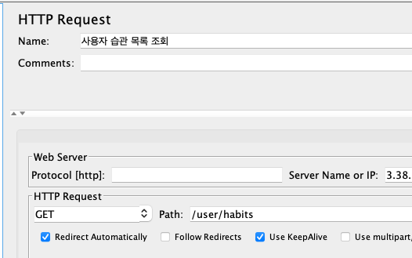
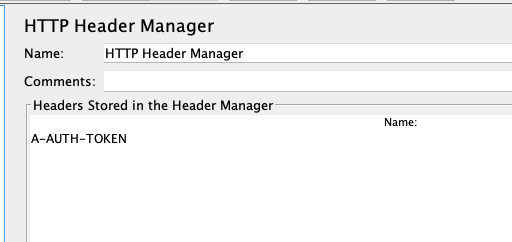
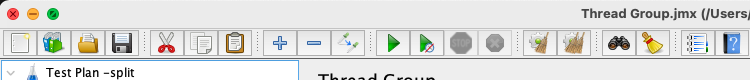
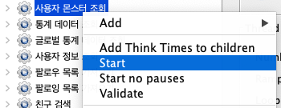

## Jmeter 부하 테스트

Jmeter로 HTTP 테스트를 하면서 두 가지 리스너를 통해서 성능 정보를 추출했다.
참고 : https://kamang-it.tistory.com/398

**Mac에서 Jmeter 설치**

```bash
> brew install jmeter
```

**실행**

```bash
> jmeter
```


**Thread Group**
모든 테스트는 아래와 같은 **Thread** 설정을 통해 요청된다.


- **Number of Threads** : 스레드를 동시에 몇개 생성할지이다. 즉 동시에 몇개의 트랜잭션을 실행시킬지이다.
  이는 사람이 동시에 접속하는 효과를 낸다. 10명이서 동시에 접속하는 상황을 만들고 싶다면 10을 사용하면 된다.
- **Ramp-Up Period** : 스레드를 Ramp-Up Period시간동안 실행해라는 의미이다. 단 균등하게 시간을 나눠서 실행하려고 노력한다. 예를 들어 Nomber of Threads가 10인데 Ramp-Up Period가 60이면 10개의 쓰레드가 6초간격으로 동작하려고 한다. 근데 그렇게 안될 수도 있다.
- **Loop Count** : 스레드의 반복 횟수를 의미한다. 10이면 10번 반복한다. Infinite에 체크하면 무한 반복한다.


**Http Request Sampler**
테스트 할 HTTP 요청을 설정 및 저장할 수 있다.



**Http Header Manager**
HTTP 요청의 헤더를 설정할 수 있다.




**테스트 실행**
상단의 Start 버튼을 클릭하면 Test Plan의 모든 스레드 그룹이 실행된다. 



여러 스레드 그룹으로 관리하는 경우에는 스레드 그룹을 우클릭하여 Start 한다.



**Summary Report**
설정한 Http Request 별로 성능 데이터를 요약한다.

- 50개 유저에서 개별 HTTP 요청 100번 씩


- 사용자 10000건 추가

  

- 5개 유저에서 모든 요청 100번 씩


- 사용자 10000건 추가

  

- user(social_id) 인덱스 추가

  ```sql
  SELECT user0_.id            AS id1_14_,
         user0_.created_at    AS created_2_14_,
         user0_.disabled      AS disabled3_14_,
         user0_.email         AS email4_14_,
         user0_.monster_id    AS monster_9_14_,
         user0_.monster_code  AS monster_5_14_,
         user0_.provider_type AS provider6_14_,
         user0_.social_id     AS social_i7_14_,
         user0_.username      AS username8_14_
  FROM   USER user0_
  WHERE  user0_.social_id = ?
  ```

  ```java
  @Entity
  @Table(uniqueConstraints = @UniqueConstraint(columnNames = "social_id"))
  public class User extends TimeStamped {
  
      @Column(name="social_id")
      private String socialId;
  ```

  

  


**View Results in Table**

각 요청마다의 아웃풋을 확인할 수 있기 때문에 summary report 보다 상세하게 확인할 수 있다.


