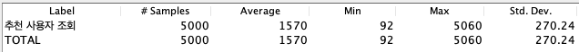
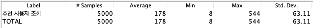
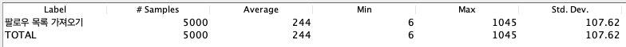

## 오늘의 삽질

### org.hibernate.QueryException: query specified join fetching, but the owner of the fetched association was not present in the select list

QueryDSL 쿼리 프로젝션을 사용해서 Entity가 아닌 특정 클래스에 SQL로 조회한 데이터를 담으면서 발생한 에러이다.

```java
    @Override
    public List<RecommendationVo> searchByNumber(User login, int number) {
        return queryFactory
                .select(new QRecommendationVo(recommendation.type,
                        new QFollowVo(
                                user.username,
                                monsterDatabase.id,
                                monsterDatabase.imageUrl,
                                user.monsterCode,
                                new CaseBuilder()
                                        .when(follow.id.isNull())
                                        .then(Boolean.FALSE)
                                        .otherwise(Boolean.TRUE))
                        ))
                .from(recommendation).fetchJoin()
                .join(recommendation.user, user).fetchJoin()
                .join(user.monster, monster).fetchJoin()
                .join(monster.monsterDatabase, monsterDatabase)
                .leftJoin(follow)
                    .on(user.eq(follow.following)
                            .and(follow.follower.eq(login))
                    )
                .where(recommendation.number.eq(number))
                .fetch();
    }
```

RecommendationVo에 바로 담을 것이기 때문에 엔티티는 사용할 수 없다. 즉, 이 쿼리는 엔티티 그래프를 참조할 수 없는 쿼리이므로 fetch Join을 제거하고 순수한 join으로 변경하여 해결했다.

참고 : https://www.inflearn.com/questions/23847


#### **추천 사용자 조회 쿼리 튜닝**

```sql
HIBERNATE:

SELECT recommenda0_.id      AS id1_12_0_,
       user1_.id            AS id1_14_1_,
       recommenda0_.number  AS number2_12_0_,
       recommenda0_.type    AS type3_12_0_,
       recommenda0_.user_id AS user_id4_12_0_,
       user1_.created_at    AS created_2_14_1_,
       user1_.disabled      AS disabled3_14_1_,
       user1_.email         AS email4_14_1_,
       user1_.monster_id    AS monster_9_14_1_,
       user1_.monster_code  AS monster_5_14_1_,
       user1_.provider_type AS provider6_14_1_,
       user1_.social_id     AS social_i7_14_1_,
       user1_.username      AS username8_14_1_
FROM   recommendation recommenda0_
       INNER JOIN USER user1_
               ON recommenda0_.user_id = user1_.id
WHERE  recommenda0_.number = ?

HIBERNATE:

SELECT user0_.id            AS id1_14_,
       user0_.created_at    AS created_2_14_,
       user0_.disabled      AS disabled3_14_,
       user0_.email         AS email4_14_,
       user0_.monster_id    AS monster_9_14_,
       user0_.monster_code  AS monster_5_14_,
       user0_.provider_type AS provider6_14_,
       user0_.social_id     AS social_i7_14_,
       user0_.username      AS username8_14_
FROM   USER user0_
WHERE  user0_.monster_code = ?

HIBERNATE:

SELECT follow0_.id           AS id1_1_,
       follow0_.follower_id  AS follower2_1_,
       follow0_.following_id AS followin3_1_
FROM   follow follow0_
       LEFT OUTER JOIN USER user1_
                    ON follow0_.follower_id = user1_.id
       LEFT OUTER JOIN USER user2_
                    ON follow0_.following_id = user2_.id
WHERE  user1_.id = ?
       AND user2_.id = ?

HIBERNATE:

SELECT monster0_.id                  AS id1_6_0_,
       monster0_.created_at          AS created_2_6_0_,
       monster0_.exp_point           AS exp_poin3_6_0_,
       monster0_.level               AS level4_6_0_,
       monster0_.monster_database_id AS monster_6_6_0_,
       monster0_.NAME                AS name5_6_0_
FROM   monster monster0_
WHERE  monster0_.id = ?

HIBERNATE:

SELECT monsterdat0_.id           AS id1_9_0_,
       monsterdat0_.image_url    AS image_ur2_9_0_,
       monsterdat0_.level        AS level3_9_0_,
       monsterdat0_.monster_type AS monster_4_9_0_
FROM   monster_database monsterdat0_
WHERE  monsterdat0_.id = ?

HIBERNATE:

SELECT user0_.id            AS id1_14_,
       user0_.created_at    AS created_2_14_,
       user0_.disabled      AS disabled3_14_,
       user0_.email         AS email4_14_,
       user0_.monster_id    AS monster_9_14_,
       user0_.monster_code  AS monster_5_14_,
       user0_.provider_type AS provider6_14_,
       user0_.social_id     AS social_i7_14_,
       user0_.username      AS username8_14_
FROM   USER user0_
WHERE  user0_.monster_code = ?

HIBERNATE:

SELECT follow0_.id           AS id1_1_,
       follow0_.follower_id  AS follower2_1_,
       follow0_.following_id AS followin3_1_
FROM   follow follow0_
       LEFT OUTER JOIN USER user1_
                    ON follow0_.follower_id = user1_.id
       LEFT OUTER JOIN USER user2_
                    ON follow0_.following_id = user2_.id
WHERE  user1_.id = ?
       AND user2_.id = ?

HIBERNATE:

SELECT monster0_.id                  AS id1_6_0_,
       monster0_.created_at          AS created_2_6_0_,
       monster0_.exp_point           AS exp_poin3_6_0_,
       monster0_.level               AS level4_6_0_,
       monster0_.monster_database_id AS monster_6_6_0_,
       monster0_.NAME                AS name5_6_0_
FROM   monster monster0_
WHERE  monster0_.id = ?

HIBERNATE:

SELECT monsterdat0_.id           AS id1_9_0_,
       monsterdat0_.image_url    AS image_ur2_9_0_,
       monsterdat0_.level        AS level3_9_0_,
       monsterdat0_.monster_type AS monster_4_9_0_
FROM   monster_database monsterdat0_
WHERE  monsterdat0_.id = ?

HIBERNATE:

SELECT user0_.id            AS id1_14_,
       user0_.created_at    AS created_2_14_,
       user0_.disabled      AS disabled3_14_,
       user0_.email         AS email4_14_,
       user0_.monster_id    AS monster_9_14_,
       user0_.monster_code  AS monster_5_14_,
       user0_.provider_type AS provider6_14_,
       user0_.social_id     AS social_i7_14_,
       user0_.username      AS username8_14_
FROM   USER user0_
WHERE  user0_.monster_code = ?

HIBERNATE:

SELECT follow0_.id           AS id1_1_,
       follow0_.follower_id  AS follower2_1_,
       follow0_.following_id AS followin3_1_
FROM   follow follow0_
       LEFT OUTER JOIN USER user1_
                    ON follow0_.follower_id = user1_.id
       LEFT OUTER JOIN USER user2_
                    ON follow0_.following_id = user2_.id
WHERE  user1_.id = ?
       AND user2_.id = ?

HIBERNATE:

SELECT monster0_.id                  AS id1_6_0_,
       monster0_.created_at          AS created_2_6_0_,
       monster0_.exp_point           AS exp_poin3_6_0_,
       monster0_.level               AS level4_6_0_,
       monster0_.monster_database_id AS monster_6_6_0_,
       monster0_.NAME                AS name5_6_0_
FROM   monster monster0_
WHERE  monster0_.id = ?

HIBERNATE:

SELECT monsterdat0_.id           AS id1_9_0_,
       monsterdat0_.image_url    AS image_ur2_9_0_,
       monsterdat0_.level        AS level3_9_0_,
       monsterdat0_.monster_type AS monster_4_9_0_
FROM   monster_database monsterdat0_
WHERE  monsterdat0_.id = ?

HIBERNATE:

SELECT user0_.id            AS id1_14_,
       user0_.created_at    AS created_2_14_,
       user0_.disabled      AS disabled3_14_,
       user0_.email         AS email4_14_,
       user0_.monster_id    AS monster_9_14_,
       user0_.monster_code  AS monster_5_14_,
       user0_.provider_type AS provider6_14_,
       user0_.social_id     AS social_i7_14_,
       user0_.username      AS username8_14_
FROM   USER user0_
WHERE  user0_.monster_code = ?

HIBERNATE:

SELECT follow0_.id           AS id1_1_,
       follow0_.follower_id  AS follower2_1_,
       follow0_.following_id AS followin3_1_
FROM   follow follow0_
       LEFT OUTER JOIN USER user1_
                    ON follow0_.follower_id = user1_.id
       LEFT OUTER JOIN USER user2_
                    ON follow0_.following_id = user2_.id
WHERE  user1_.id = ?
       AND user2_.id = ?

HIBERNATE:

SELECT monster0_.id                  AS id1_6_0_,
       monster0_.created_at          AS created_2_6_0_,
       monster0_.exp_point           AS exp_poin3_6_0_,
       monster0_.level               AS level4_6_0_,
       monster0_.monster_database_id AS monster_6_6_0_,
       monster0_.NAME                AS name5_6_0_
FROM   monster monster0_
WHERE  monster0_.id = ?

HIBERNATE:

SELECT monsterdat0_.id           AS id1_9_0_,
       monsterdat0_.image_url    AS image_ur2_9_0_,
       monsterdat0_.level        AS level3_9_0_,
       monsterdat0_.monster_type AS monster_4_9_0_
FROM   monster_database monsterdat0_
WHERE  monsterdat0_.id = ?

HIBERNATE:

SELECT user0_.id            AS id1_14_,
       user0_.created_at    AS created_2_14_,
       user0_.disabled      AS disabled3_14_,
       user0_.email         AS email4_14_,
       user0_.monster_id    AS monster_9_14_,
       user0_.monster_code  AS monster_5_14_,
       user0_.provider_type AS provider6_14_,
       user0_.social_id     AS social_i7_14_,
       user0_.username      AS username8_14_
FROM   USER user0_
WHERE  user0_.monster_code = ?

HIBERNATE:

SELECT follow0_.id           AS id1_1_,
       follow0_.follower_id  AS follower2_1_,
       follow0_.following_id AS followin3_1_
FROM   follow follow0_
       LEFT OUTER JOIN USER user1_
                    ON follow0_.follower_id = user1_.id
       LEFT OUTER JOIN USER user2_
                    ON follow0_.following_id = user2_.id
WHERE  user1_.id = ?
       AND user2_.id = ?

HIBERNATE:

SELECT monster0_.id                  AS id1_6_0_,
       monster0_.created_at          AS created_2_6_0_,
       monster0_.exp_point           AS exp_poin3_6_0_,
       monster0_.level               AS level4_6_0_,
       monster0_.monster_database_id AS monster_6_6_0_,
       monster0_.NAME                AS name5_6_0_
FROM   monster monster0_
WHERE  monster0_.id = ?

HIBERNATE:

SELECT monsterdat0_.id           AS id1_9_0_,
       monsterdat0_.image_url    AS image_ur2_9_0_,
       monsterdat0_.level        AS level3_9_0_,
       monsterdat0_.monster_type AS monster_4_9_0_
FROM   monster_database monsterdat0_
WHERE  monsterdat0_.id = ? 
```

**조치사항**

- ASIS (N+1)
  

- 인증 관련 컬럼 유니크 제약조건 (social_id)
  

- QeuryDSL Join, projection
  
- 인덱스 추가 Recommendation(number)
  

```sql
SELECT Cast(recommenda0_.type AS CHAR) AS col_0_0_,
       user1_.username                 AS col_1_0_,
       monsterdat3_.id                 AS col_2_0_,
       monsterdat3_.image_url          AS col_3_0_,
       user1_.monster_code             AS col_4_0_,
       CASE
         WHEN follow4_.id IS NULL THEN ?
         ELSE 1
       END                             AS col_5_0_
FROM   recommendation recommenda0_
       INNER JOIN USER user1_
               ON recommenda0_.user_id = user1_.id
       INNER JOIN monster monster2_
               ON user1_.monster_id = monster2_.id
       INNER JOIN monster_database monsterdat3_
               ON monster2_.monster_database_id = monsterdat3_.id
       LEFT OUTER JOIN follow follow4_
                    ON ( user1_.id = follow4_.following_id
                         AND follow4_.follower_id = ? )
WHERE  recommenda0_.number = ? 
```


#### 팔로우 목록 가져오기

```sql
HIBERNATE:

SELECT follow0_.id           AS id1_1_,
       follow0_.follower_id  AS follower2_1_,
       follow0_.following_id AS followin3_1_
FROM   follow follow0_
       LEFT OUTER JOIN USER user1_
                    ON follow0_.following_id = user1_.id
WHERE  user1_.id = ?

HIBERNATE:

SELECT user0_.id            AS id1_14_0_,
       user0_.created_at    AS created_2_14_0_,
       user0_.disabled      AS disabled3_14_0_,
       user0_.email         AS email4_14_0_,
       user0_.monster_id    AS monster_9_14_0_,
       user0_.monster_code  AS monster_5_14_0_,
       user0_.provider_type AS provider6_14_0_,
       user0_.social_id     AS social_i7_14_0_,
       user0_.username      AS username8_14_0_
FROM   USER user0_
WHERE  user0_.id = ?

HIBERNATE:

SELECT user0_.id            AS id1_14_0_,
       user0_.created_at    AS created_2_14_0_,
       user0_.disabled      AS disabled3_14_0_,
       user0_.email         AS email4_14_0_,
       user0_.monster_id    AS monster_9_14_0_,
       user0_.monster_code  AS monster_5_14_0_,
       user0_.provider_type AS provider6_14_0_,
       user0_.social_id     AS social_i7_14_0_,
       user0_.username      AS username8_14_0_
FROM   USER user0_
WHERE  user0_.id = ?

HIBERNATE:

SELECT user0_.id            AS id1_14_0_,
       user0_.created_at    AS created_2_14_0_,
       user0_.disabled      AS disabled3_14_0_,
       user0_.email         AS email4_14_0_,
       user0_.monster_id    AS monster_9_14_0_,
       user0_.monster_code  AS monster_5_14_0_,
       user0_.provider_type AS provider6_14_0_,
       user0_.social_id     AS social_i7_14_0_,
       user0_.username      AS username8_14_0_
FROM   USER user0_
WHERE  user0_.id = ?

HIBERNATE:

SELECT user0_.id            AS id1_14_,
       user0_.created_at    AS created_2_14_,
       user0_.disabled      AS disabled3_14_,
       user0_.email         AS email4_14_,
       user0_.monster_id    AS monster_9_14_,
       user0_.monster_code  AS monster_5_14_,
       user0_.provider_type AS provider6_14_,
       user0_.social_id     AS social_i7_14_,
       user0_.username      AS username8_14_
FROM   USER user0_
WHERE  user0_.monster_code = ?

HIBERNATE:

SELECT follow0_.id           AS id1_1_,
       follow0_.follower_id  AS follower2_1_,
       follow0_.following_id AS followin3_1_
FROM   follow follow0_
       LEFT OUTER JOIN USER user1_
                    ON follow0_.follower_id = user1_.id
       LEFT OUTER JOIN USER user2_
                    ON follow0_.following_id = user2_.id
WHERE  user1_.id = ?
       AND user2_.id = ?

HIBERNATE:

SELECT monster0_.id                  AS id1_6_0_,
       monster0_.created_at          AS created_2_6_0_,
       monster0_.exp_point           AS exp_poin3_6_0_,
       monster0_.level               AS level4_6_0_,
       monster0_.monster_database_id AS monster_6_6_0_,
       monster0_.NAME                AS name5_6_0_
FROM   monster monster0_
WHERE  monster0_.id = ?

HIBERNATE:

SELECT monsterdat0_.id           AS id1_9_0_,
       monsterdat0_.image_url    AS image_ur2_9_0_,
       monsterdat0_.level        AS level3_9_0_,
       monsterdat0_.monster_type AS monster_4_9_0_
FROM   monster_database monsterdat0_
WHERE  monsterdat0_.id = ?

HIBERNATE:

SELECT user0_.id            AS id1_14_,
       user0_.created_at    AS created_2_14_,
       user0_.disabled      AS disabled3_14_,
       user0_.email         AS email4_14_,
       user0_.monster_id    AS monster_9_14_,
       user0_.monster_code  AS monster_5_14_,
       user0_.provider_type AS provider6_14_,
       user0_.social_id     AS social_i7_14_,
       user0_.username      AS username8_14_
FROM   USER user0_
WHERE  user0_.monster_code = ?

HIBERNATE:

SELECT follow0_.id           AS id1_1_,
       follow0_.follower_id  AS follower2_1_,
       follow0_.following_id AS followin3_1_
FROM   follow follow0_
       LEFT OUTER JOIN USER user1_
                    ON follow0_.follower_id = user1_.id
       LEFT OUTER JOIN USER user2_
                    ON follow0_.following_id = user2_.id
WHERE  user1_.id = ?
       AND user2_.id = ?

HIBERNATE:

SELECT monster0_.id                  AS id1_6_0_,
       monster0_.created_at          AS created_2_6_0_,
       monster0_.exp_point           AS exp_poin3_6_0_,
       monster0_.level               AS level4_6_0_,
       monster0_.monster_database_id AS monster_6_6_0_,
       monster0_.NAME                AS name5_6_0_
FROM   monster monster0_
WHERE  monster0_.id = ?

HIBERNATE:

SELECT monsterdat0_.id           AS id1_9_0_,
       monsterdat0_.image_url    AS image_ur2_9_0_,
       monsterdat0_.level        AS level3_9_0_,
       monsterdat0_.monster_type AS monster_4_9_0_
FROM   monster_database monsterdat0_
WHERE  monsterdat0_.id = ?

HIBERNATE:

SELECT user0_.id            AS id1_14_,
       user0_.created_at    AS created_2_14_,
       user0_.disabled      AS disabled3_14_,
       user0_.email         AS email4_14_,
       user0_.monster_id    AS monster_9_14_,
       user0_.monster_code  AS monster_5_14_,
       user0_.provider_type AS provider6_14_,
       user0_.social_id     AS social_i7_14_,
       user0_.username      AS username8_14_
FROM   USER user0_
WHERE  user0_.monster_code = ?

HIBERNATE:

SELECT follow0_.id           AS id1_1_,
       follow0_.follower_id  AS follower2_1_,
       follow0_.following_id AS followin3_1_
FROM   follow follow0_
       LEFT OUTER JOIN USER user1_
                    ON follow0_.follower_id = user1_.id
       LEFT OUTER JOIN USER user2_
                    ON follow0_.following_id = user2_.id
WHERE  user1_.id = ?
       AND user2_.id = ?

HIBERNATE:

SELECT monster0_.id                  AS id1_6_0_,
       monster0_.created_at          AS created_2_6_0_,
       monster0_.exp_point           AS exp_poin3_6_0_,
       monster0_.level               AS level4_6_0_,
       monster0_.monster_database_id AS monster_6_6_0_,
       monster0_.NAME                AS name5_6_0_
FROM   monster monster0_
WHERE  monster0_.id = ?

HIBERNATE:

SELECT monsterdat0_.id           AS id1_9_0_,
       monsterdat0_.image_url    AS image_ur2_9_0_,
       monsterdat0_.level        AS level3_9_0_,
       monsterdat0_.monster_type AS monster_4_9_0_
FROM   monster_database monsterdat0_
WHERE  monsterdat0_.id = ? 
```


**조치사항**

- ASIS (N+1)
  

- 인증 관련 컬럼 유니크 제약조건 (social_id)
  

- QeuryDSL Join, projection
  
- 인덱스 추가 Follow(follower, following)
  

```sql
SELECT user1_.username        AS col_0_0_,
       monsterdat3_.id        AS col_1_0_,
       monsterdat3_.image_url AS col_2_0_,
       user1_.monster_code    AS col_3_0_,
       CASE
         WHEN follow4_.id IS NULL THEN ?
         ELSE 1
       END                    AS col_4_0_
FROM   follow follow0_
       INNER JOIN USER user1_
               ON follow0_.follower_id = user1_.id
       INNER JOIN monster monster2_
               ON user1_.monster_id = monster2_.id
       INNER JOIN monster_database monsterdat3_
               ON monster2_.monster_database_id = monsterdat3_.id
       LEFT OUTER JOIN follow follow4_
                    ON ( follow4_.follower_id = ?
                         AND follow4_.following_id = user1_.id )
WHERE  follow0_.following_id = ? 
```


#### 특정 사용자 정보 조회

```sql
HIBERNATE:

SELECT user0_.id            AS id1_14_,
       user0_.created_at    AS created_2_14_,
       user0_.disabled      AS disabled3_14_,
       user0_.email         AS email4_14_,
       user0_.monster_id    AS monster_9_14_,
       user0_.monster_code  AS monster_5_14_,
       user0_.provider_type AS provider6_14_,
       user0_.social_id     AS social_i7_14_,
       user0_.username      AS username8_14_
FROM   USER user0_
WHERE  user0_.monster_code = ?

HIBERNATE:

SELECT follow0_.id           AS id1_1_,
       follow0_.follower_id  AS follower2_1_,
       follow0_.following_id AS followin3_1_
FROM   follow follow0_
       LEFT OUTER JOIN USER user1_
                    ON follow0_.follower_id = user1_.id
       LEFT OUTER JOIN USER user2_
                    ON follow0_.following_id = user2_.id
WHERE  user1_.id = ?
       AND user2_.id = ?

HIBERNATE:

SELECT Count(follow0_.id) AS col_0_0_
FROM   follow follow0_
WHERE  follow0_.following_id = ?

HIBERNATE:

SELECT Count(follow0_.id) AS col_0_0_
FROM   follow follow0_
WHERE  follow0_.follower_id = ?

HIBERNATE:

SELECT Count(habit0_.id) AS col_0_0_
FROM   habit habit0_
WHERE  habit0_.user_id = ?

HIBERNATE:

SELECT Count(completedh0_.id) AS col_0_0_
FROM   completed_habit completedh0_
WHERE  completedh0_.user_id = ?

HIBERNATE:

SELECT monster0_.id                  AS id1_6_0_,
       user1_.id                     AS id1_14_1_,
       monster0_.created_at          AS created_2_6_0_,
       monster0_.exp_point           AS exp_poin3_6_0_,
       monster0_.level               AS level4_6_0_,
       monster0_.monster_database_id AS monster_6_6_0_,
       monster0_.NAME                AS name5_6_0_,
       user1_.created_at             AS created_2_14_1_,
       user1_.disabled               AS disabled3_14_1_,
       user1_.email                  AS email4_14_1_,
       user1_.monster_id             AS monster_9_14_1_,
       user1_.monster_code           AS monster_5_14_1_,
       user1_.provider_type          AS provider6_14_1_,
       user1_.social_id              AS social_i7_14_1_,
       user1_.username               AS username8_14_1_
FROM   monster monster0_
       INNER JOIN USER user1_
               ON monster0_.id = user1_.monster_id
WHERE  user1_.id = ?

HIBERNATE:

SELECT monsterdat0_.id           AS id1_9_0_,
       monsterdat0_.image_url    AS image_ur2_9_0_,
       monsterdat0_.level        AS level3_9_0_,
       monsterdat0_.monster_type AS monster_4_9_0_
FROM   monster_database monsterdat0_
WHERE  monsterdat0_.id = ?

HIBERNATE:

SELECT habit0_.id                       AS id2_2_,
       habit0_.created_at               AS created_3_2_,
       habit0_.accomplish_counter       AS accompli4_2_,
       habit0_.category                 AS category5_2_,
       habit0_.description              AS descript6_2_,
       habit0_.duration_end             AS duration7_2_,
       habit0_.duration_start           AS duration8_2_,
       habit0_.is_accomplish_in_session AS is_accom9_2_,
       habit0_.n_per_day                AS n_per_d10_2_,
       habit0_.next_practice_day        AS next_pr11_2_,
       habit0_.practice_days            AS practic12_2_,
       habit0_.session_duration         AS session13_2_,
       habit0_.title                    AS title14_2_,
       habit0_.user_id                  AS user_id16_2_,
       habit0_.whole_days               AS whole_d15_2_,
       habit0_1_.current_duration       AS current_1_4_,
       habit0_1_.goal_duration_time     AS goal_dur2_4_,
       habit0_2_.goal_count_in_session  AS goal_cou1_3_,
       habit0_2_.today_counter          AS today_co2_3_,
       habit0_.dtype                    AS dtype1_2_
FROM   habit habit0_
       LEFT OUTER JOIN habit_with_timer habit0_1_
                    ON habit0_.id = habit0_1_.id
       LEFT OUTER JOIN habit_with_counter habit0_2_
                    ON habit0_.id = habit0_2_.id
WHERE  habit0_.user_id = ?
ORDER  BY habit0_.created_at DESC 
```


**조치사항**

- ASIS
  

- 인증 관련 컬럼 유니크 제약조건 (social_id)
  

- QeuryDSL Join, projection
  

  ```sql
  HIBERNATE:
  
  SELECT user0_.monster_code       AS col_0_0_,
         user0_.username           AS col_1_0_,
         user0_.email              AS col_2_0_,
         monsterdat2_.id           AS col_3_0_,
         monsterdat2_.monster_type AS col_4_0_,
         monsterdat2_.image_url    AS col_5_0_,
         monster1_.NAME            AS col_6_0_,
         monster1_.level           AS col_7_0_,
         monster1_.exp_point       AS col_8_0_,
         monster1_.created_at      AS col_9_0_,
         CASE
           WHEN follow3_.id IS NOT NULL THEN ?
           WHEN user0_.id = ? THEN NULL
           ELSE 0
         END                       AS col_10_0_,
         user0_.id                 AS col_11_0_,
         user0_.id                 AS id1_14_,
         user0_.created_at         AS created_2_14_,
         user0_.disabled           AS disabled3_14_,
         user0_.email              AS email4_14_,
         user0_.monster_id         AS monster_9_14_,
         user0_.monster_code       AS monster_5_14_,
         user0_.provider_type      AS provider6_14_,
         user0_.social_id          AS social_i7_14_,
         user0_.username           AS username8_14_
  FROM   USER user0_
         INNER JOIN monster monster1_
                 ON user0_.monster_id = monster1_.id
         INNER JOIN monster_database monsterdat2_
                 ON monster1_.monster_database_id = monsterdat2_.id
         LEFT OUTER JOIN follow follow3_
                      ON ( follow3_.follower_id = ?
                           AND follow3_.following_id = user0_.id )
  WHERE  user0_.monster_code = ?
  
  HIBERNATE:
  
  SELECT Count(follow0_.id) AS col_0_0_
  FROM   follow follow0_
         INNER JOIN USER user1_
                 ON follow0_.follower_id = user1_.id
  WHERE  follow0_.following_id = ?
         AND user1_.disabled = ?
  
  HIBERNATE:
  
  SELECT Count(follow0_.id) AS col_0_0_
  FROM   follow follow0_
         INNER JOIN USER user1_
                 ON follow0_.following_id = user1_.id
  WHERE  follow0_.follower_id = ?
         AND user1_.disabled = ?
  
  HIBERNATE:
  
  SELECT Count(habit0_.id) AS col_0_0_
  FROM   habit habit0_
  WHERE  habit0_.user_id = ?
  
  HIBERNATE:
  
  SELECT Count(completedh0_.id) AS col_0_0_
  FROM   completed_habit completedh0_
  WHERE  completedh0_.user_id = ?
  
  HIBERNATE:
  
  SELECT habit0_.id                       AS id2_2_,
         habit0_.created_at               AS created_3_2_,
         habit0_.accomplish_counter       AS accompli4_2_,
         habit0_.category                 AS category5_2_,
         habit0_.description              AS descript6_2_,
         habit0_.duration_end             AS duration7_2_,
         habit0_.duration_start           AS duration8_2_,
         habit0_.is_accomplish_in_session AS is_accom9_2_,
         habit0_.n_per_day                AS n_per_d10_2_,
         habit0_.next_practice_day        AS next_pr11_2_,
         habit0_.practice_days            AS practic12_2_,
         habit0_.session_duration         AS session13_2_,
         habit0_.title                    AS title14_2_,
         habit0_.user_id                  AS user_id16_2_,
         habit0_.whole_days               AS whole_d15_2_,
         habit0_1_.current_duration       AS current_1_4_,
         habit0_1_.goal_duration_time     AS goal_dur2_4_,
         habit0_2_.goal_count_in_session  AS goal_cou1_3_,
         habit0_2_.today_counter          AS today_co2_3_,
         habit0_.dtype                    AS dtype1_2_
  FROM   habit habit0_
         LEFT OUTER JOIN habit_with_timer habit0_1_
                      ON habit0_.id = habit0_1_.id
         LEFT OUTER JOIN habit_with_counter habit0_2_
                      ON habit0_.id = habit0_2_.id
  WHERE  habit0_.user_id = ?
  ORDER  BY habit0_.created_at DESC 
  ```

  

- user(monster_code) 인덱스 추가
  

  

#### 친구 검색

```
HIBERNATE:

SELECT user0_.id            AS id1_14_,
       user0_.created_at    AS created_2_14_,
       user0_.disabled      AS disabled3_14_,
       user0_.email         AS email4_14_,
       user0_.monster_id    AS monster_9_14_,
       user0_.monster_code  AS monster_5_14_,
       user0_.provider_type AS provider6_14_,
       user0_.social_id     AS social_i7_14_,
       user0_.username      AS username8_14_
FROM   USER user0_
WHERE  user0_.monster_code = ?

HIBERNATE:

SELECT user0_.id            AS id1_14_,
       user0_.created_at    AS created_2_14_,
       user0_.disabled      AS disabled3_14_,
       user0_.email         AS email4_14_,
       user0_.monster_id    AS monster_9_14_,
       user0_.monster_code  AS monster_5_14_,
       user0_.provider_type AS provider6_14_,
       user0_.social_id     AS social_i7_14_,
       user0_.username      AS username8_14_
FROM   USER user0_
WHERE  user0_.monster_code = ?

HIBERNATE:

SELECT follow0_.id           AS id1_1_,
       follow0_.follower_id  AS follower2_1_,
       follow0_.following_id AS followin3_1_
FROM   follow follow0_
       LEFT OUTER JOIN USER user1_
                    ON follow0_.follower_id = user1_.id
       LEFT OUTER JOIN USER user2_
                    ON follow0_.following_id = user2_.id
WHERE  user1_.id = ?
       AND user2_.id = ?

HIBERNATE:

SELECT monster0_.id                  AS id1_6_0_,
       monster0_.created_at          AS created_2_6_0_,
       monster0_.exp_point           AS exp_poin3_6_0_,
       monster0_.level               AS level4_6_0_,
       monster0_.monster_database_id AS monster_6_6_0_,
       monster0_.NAME                AS name5_6_0_
FROM   monster monster0_
WHERE  monster0_.id = ?

HIBERNATE:

SELECT monsterdat0_.id           AS id1_9_0_,
       monsterdat0_.image_url    AS image_ur2_9_0_,
       monsterdat0_.level        AS level3_9_0_,
       monsterdat0_.monster_type AS monster_4_9_0_
FROM   monster_database monsterdat0_
WHERE  monsterdat0_.id = ? 
```


**조치사항**

- ASIS
  

- 인증 관련 컬럼 유니크 제약조건 (social_id)
  

- QeuryDSL Join, projection
  
  
- 인덱스 추가 Recommendation(number)


