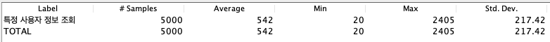
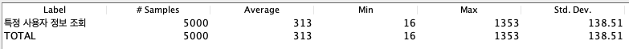
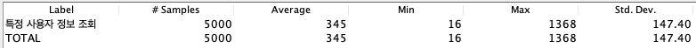
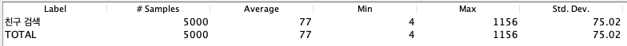

## 성능 개선

#### 특정 사용자 정보 조회

```sql
HIBERNATE:

SELECT user0_.id            AS id1_14_,
       user0_.created_at    AS created_2_14_,
       user0_.disabled      AS disabled3_14_,
       user0_.email         AS email4_14_,
       user0_.monster_id    AS monster_9_14_,
       user0_.monster_code  AS monster_5_14_,
       user0_.provider_type AS provider6_14_,
       user0_.social_id     AS social_i7_14_,
       user0_.username      AS username8_14_
FROM   USER user0_
WHERE  user0_.monster_code = ?

HIBERNATE:

SELECT follow0_.id           AS id1_1_,
       follow0_.follower_id  AS follower2_1_,
       follow0_.following_id AS followin3_1_
FROM   follow follow0_
       LEFT OUTER JOIN USER user1_
                    ON follow0_.follower_id = user1_.id
       LEFT OUTER JOIN USER user2_
                    ON follow0_.following_id = user2_.id
WHERE  user1_.id = ?
       AND user2_.id = ?

HIBERNATE:

SELECT Count(follow0_.id) AS col_0_0_
FROM   follow follow0_
WHERE  follow0_.following_id = ?

HIBERNATE:

SELECT Count(follow0_.id) AS col_0_0_
FROM   follow follow0_
WHERE  follow0_.follower_id = ?

HIBERNATE:

SELECT Count(habit0_.id) AS col_0_0_
FROM   habit habit0_
WHERE  habit0_.user_id = ?

HIBERNATE:

SELECT Count(completedh0_.id) AS col_0_0_
FROM   completed_habit completedh0_
WHERE  completedh0_.user_id = ?

HIBERNATE:

SELECT monster0_.id                  AS id1_6_0_,
       user1_.id                     AS id1_14_1_,
       monster0_.created_at          AS created_2_6_0_,
       monster0_.exp_point           AS exp_poin3_6_0_,
       monster0_.level               AS level4_6_0_,
       monster0_.monster_database_id AS monster_6_6_0_,
       monster0_.NAME                AS name5_6_0_,
       user1_.created_at             AS created_2_14_1_,
       user1_.disabled               AS disabled3_14_1_,
       user1_.email                  AS email4_14_1_,
       user1_.monster_id             AS monster_9_14_1_,
       user1_.monster_code           AS monster_5_14_1_,
       user1_.provider_type          AS provider6_14_1_,
       user1_.social_id              AS social_i7_14_1_,
       user1_.username               AS username8_14_1_
FROM   monster monster0_
       INNER JOIN USER user1_
               ON monster0_.id = user1_.monster_id
WHERE  user1_.id = ?

HIBERNATE:

SELECT monsterdat0_.id           AS id1_9_0_,
       monsterdat0_.image_url    AS image_ur2_9_0_,
       monsterdat0_.level        AS level3_9_0_,
       monsterdat0_.monster_type AS monster_4_9_0_
FROM   monster_database monsterdat0_
WHERE  monsterdat0_.id = ?

HIBERNATE:

SELECT habit0_.id                       AS id2_2_,
       habit0_.created_at               AS created_3_2_,
       habit0_.accomplish_counter       AS accompli4_2_,
       habit0_.category                 AS category5_2_,
       habit0_.description              AS descript6_2_,
       habit0_.duration_end             AS duration7_2_,
       habit0_.duration_start           AS duration8_2_,
       habit0_.is_accomplish_in_session AS is_accom9_2_,
       habit0_.n_per_day                AS n_per_d10_2_,
       habit0_.next_practice_day        AS next_pr11_2_,
       habit0_.practice_days            AS practic12_2_,
       habit0_.session_duration         AS session13_2_,
       habit0_.title                    AS title14_2_,
       habit0_.user_id                  AS user_id16_2_,
       habit0_.whole_days               AS whole_d15_2_,
       habit0_1_.current_duration       AS current_1_4_,
       habit0_1_.goal_duration_time     AS goal_dur2_4_,
       habit0_2_.goal_count_in_session  AS goal_cou1_3_,
       habit0_2_.today_counter          AS today_co2_3_,
       habit0_.dtype                    AS dtype1_2_
FROM   habit habit0_
       LEFT OUTER JOIN habit_with_timer habit0_1_
                    ON habit0_.id = habit0_1_.id
       LEFT OUTER JOIN habit_with_counter habit0_2_
                    ON habit0_.id = habit0_2_.id
WHERE  habit0_.user_id = ?
ORDER  BY habit0_.created_at DESC 
```


**조치사항**

- ASIS
  

- 인증 관련 컬럼 유니크 제약조건 (social_id)
  

- QeuryDSL Join, projection
  

  ```sql
  HIBERNATE:
  
  SELECT user0_.monster_code       AS col_0_0_,
         user0_.username           AS col_1_0_,
         user0_.email              AS col_2_0_,
         monsterdat2_.id           AS col_3_0_,
         monsterdat2_.monster_type AS col_4_0_,
         monsterdat2_.image_url    AS col_5_0_,
         monster1_.NAME            AS col_6_0_,
         monster1_.level           AS col_7_0_,
         monster1_.exp_point       AS col_8_0_,
         monster1_.created_at      AS col_9_0_,
         CASE
           WHEN follow3_.id IS NOT NULL THEN ?
           WHEN user0_.id = ? THEN NULL
           ELSE 0
         END                       AS col_10_0_,
         user0_.id                 AS col_11_0_,
         user0_.id                 AS id1_14_,
         user0_.created_at         AS created_2_14_,
         user0_.disabled           AS disabled3_14_,
         user0_.email              AS email4_14_,
         user0_.monster_id         AS monster_9_14_,
         user0_.monster_code       AS monster_5_14_,
         user0_.provider_type      AS provider6_14_,
         user0_.social_id          AS social_i7_14_,
         user0_.username           AS username8_14_
  FROM   USER user0_
         INNER JOIN monster monster1_
                 ON user0_.monster_id = monster1_.id
         INNER JOIN monster_database monsterdat2_
                 ON monster1_.monster_database_id = monsterdat2_.id
         LEFT OUTER JOIN follow follow3_
                      ON ( follow3_.follower_id = ?
                           AND follow3_.following_id = user0_.id )
  WHERE  user0_.monster_code = ?
  
  HIBERNATE:
  
  SELECT Count(follow0_.id) AS col_0_0_
  FROM   follow follow0_
         INNER JOIN USER user1_
                 ON follow0_.follower_id = user1_.id
  WHERE  follow0_.following_id = ?
         AND user1_.disabled = ?
  
  HIBERNATE:
  
  SELECT Count(follow0_.id) AS col_0_0_
  FROM   follow follow0_
         INNER JOIN USER user1_
                 ON follow0_.following_id = user1_.id
  WHERE  follow0_.follower_id = ?
         AND user1_.disabled = ?
  
  HIBERNATE:
  
  SELECT Count(habit0_.id) AS col_0_0_
  FROM   habit habit0_
  WHERE  habit0_.user_id = ?
  
  HIBERNATE:
  
  SELECT Count(completedh0_.id) AS col_0_0_
  FROM   completed_habit completedh0_
  WHERE  completedh0_.user_id = ?
  
  HIBERNATE:
  
  SELECT habit0_.id                       AS id2_2_,
         habit0_.created_at               AS created_3_2_,
         habit0_.accomplish_counter       AS accompli4_2_,
         habit0_.category                 AS category5_2_,
         habit0_.description              AS descript6_2_,
         habit0_.duration_end             AS duration7_2_,
         habit0_.duration_start           AS duration8_2_,
         habit0_.is_accomplish_in_session AS is_accom9_2_,
         habit0_.n_per_day                AS n_per_d10_2_,
         habit0_.next_practice_day        AS next_pr11_2_,
         habit0_.practice_days            AS practic12_2_,
         habit0_.session_duration         AS session13_2_,
         habit0_.title                    AS title14_2_,
         habit0_.user_id                  AS user_id16_2_,
         habit0_.whole_days               AS whole_d15_2_,
         habit0_1_.current_duration       AS current_1_4_,
         habit0_1_.goal_duration_time     AS goal_dur2_4_,
         habit0_2_.goal_count_in_session  AS goal_cou1_3_,
         habit0_2_.today_counter          AS today_co2_3_,
         habit0_.dtype                    AS dtype1_2_
  FROM   habit habit0_
         LEFT OUTER JOIN habit_with_timer habit0_1_
                      ON habit0_.id = habit0_1_.id
         LEFT OUTER JOIN habit_with_counter habit0_2_
                      ON habit0_.id = habit0_2_.id
  WHERE  habit0_.user_id = ?
  ORDER  BY habit0_.created_at DESC 
  ```

  

- user(monster_code) 인덱스 추가

  ```java
  @Entity
  @Getter
  @NoArgsConstructor(access = AccessLevel.PROTECTED)
  @Table(uniqueConstraints = {
          @UniqueConstraint(columnNames = "social_id"),
          @UniqueConstraint(columnNames = "monster_code")})
  public class User extends TimeStamped {
      @Id
      @GeneratedValue(strategy = GenerationType.IDENTITY)
      private Long id;
  
      @Column(name="social_id")
      private String socialId;
  
      @Column(name="monster_code")
      private String monsterCode;
  ```

  

  

#### 친구 검색

```sql
HIBERNATE:

SELECT user0_.id            AS id1_14_,
       user0_.created_at    AS created_2_14_,
       user0_.disabled      AS disabled3_14_,
       user0_.email         AS email4_14_,
       user0_.monster_id    AS monster_9_14_,
       user0_.monster_code  AS monster_5_14_,
       user0_.provider_type AS provider6_14_,
       user0_.social_id     AS social_i7_14_,
       user0_.username      AS username8_14_
FROM   USER user0_
WHERE  user0_.monster_code = ?

HIBERNATE:

SELECT user0_.id            AS id1_14_,
       user0_.created_at    AS created_2_14_,
       user0_.disabled      AS disabled3_14_,
       user0_.email         AS email4_14_,
       user0_.monster_id    AS monster_9_14_,
       user0_.monster_code  AS monster_5_14_,
       user0_.provider_type AS provider6_14_,
       user0_.social_id     AS social_i7_14_,
       user0_.username      AS username8_14_
FROM   USER user0_
WHERE  user0_.monster_code = ?

HIBERNATE:

SELECT follow0_.id           AS id1_1_,
       follow0_.follower_id  AS follower2_1_,
       follow0_.following_id AS followin3_1_
FROM   follow follow0_
       LEFT OUTER JOIN USER user1_
                    ON follow0_.follower_id = user1_.id
       LEFT OUTER JOIN USER user2_
                    ON follow0_.following_id = user2_.id
WHERE  user1_.id = ?
       AND user2_.id = ?

HIBERNATE:

SELECT monster0_.id                  AS id1_6_0_,
       monster0_.created_at          AS created_2_6_0_,
       monster0_.exp_point           AS exp_poin3_6_0_,
       monster0_.level               AS level4_6_0_,
       monster0_.monster_database_id AS monster_6_6_0_,
       monster0_.NAME                AS name5_6_0_
FROM   monster monster0_
WHERE  monster0_.id = ?

HIBERNATE:

SELECT monsterdat0_.id           AS id1_9_0_,
       monsterdat0_.image_url    AS image_ur2_9_0_,
       monsterdat0_.level        AS level3_9_0_,
       monsterdat0_.monster_type AS monster_4_9_0_
FROM   monster_database monsterdat0_
WHERE  monsterdat0_.id = ? 
```


**조치사항**


```sql
SELECT user0_.username        AS col_0_0_,
       monsterdat2_.id        AS col_1_0_,
       monsterdat2_.image_url AS col_2_0_,
       user0_.monster_code    AS col_3_0_,
       CASE
         WHEN follow3_.id IS NOT NULL THEN ?
         WHEN user0_.id = ? THEN NULL
         ELSE 0
       END                    AS col_4_0_
FROM   USER user0_
       INNER JOIN monster monster1_
               ON user0_.monster_id = monster1_.id
       INNER JOIN monster_database monsterdat2_
               ON monster1_.monster_database_id = monsterdat2_.id
       LEFT OUTER JOIN follow follow3_
                    ON ( follow3_.follower_id = ?
                         AND follow3_.following_id = user0_.id )
WHERE  user0_.monster_code = ?
       AND user0_.disabled = ? 
```


