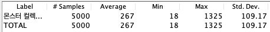
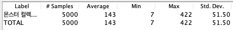

## 성능 개선

#### 몬스터 컬렉션 조회

```sql
HIBERNATE:

SELECT user0_.id            AS id1_14_,
       user0_.created_at    AS created_2_14_,
       user0_.disabled      AS disabled3_14_,
       user0_.email         AS email4_14_,
       user0_.monster_id    AS monster_9_14_,
       user0_.monster_code  AS monster_5_14_,
       user0_.provider_type AS provider6_14_,
       user0_.social_id     AS social_i7_14_,
       user0_.username      AS username8_14_
FROM   USER user0_
WHERE  user0_.social_id = ?

HIBERNATE:

SELECT monstercol0_.id           AS id1_7_,
       monstercol0_.create_at    AS create_a2_7_,
       monstercol0_.max_level    AS max_leve3_7_,
       monstercol0_.monster_name AS monster_4_7_,
       monstercol0_.monster_type AS monster_5_7_,
       monstercol0_.user_id      AS user_id6_7_
FROM   monster_collection monstercol0_
WHERE  monstercol0_.user_id = ?

HIBERNATE:

SELECT monstercol0_.monster_collection_id AS monster_2_8_0_,
       monstercol0_.id                    AS id1_8_0_,
       monstercol0_.id                    AS id1_8_1_,
       monstercol0_.monster_collection_id AS monster_2_8_1_,
       monstercol0_.monster_database_id   AS monster_3_8_1_
FROM   monster_collection_database monstercol0_
WHERE  monstercol0_.monster_collection_id = ?

HIBERNATE:

SELECT monsterdat0_.id           AS id1_9_0_,
       monsterdat0_.image_url    AS image_ur2_9_0_,
       monsterdat0_.level        AS level3_9_0_,
       monsterdat0_.monster_type AS monster_4_9_0_
FROM   monster_database monsterdat0_
WHERE  monsterdat0_.id = ?

HIBERNATE:

SELECT monsterdat0_.id           AS id1_9_0_,
       monsterdat0_.image_url    AS image_ur2_9_0_,
       monsterdat0_.level        AS level3_9_0_,
       monsterdat0_.monster_type AS monster_4_9_0_
FROM   monster_database monsterdat0_
WHERE  monsterdat0_.id = ?

HIBERNATE:

SELECT monsterdat0_.id           AS id1_9_0_,
       monsterdat0_.image_url    AS image_ur2_9_0_,
       monsterdat0_.level        AS level3_9_0_,
       monsterdat0_.monster_type AS monster_4_9_0_
FROM   monster_database monsterdat0_
WHERE  monsterdat0_.id = ?

HIBERNATE:

SELECT monsterdat0_.id           AS id1_9_0_,
       monsterdat0_.image_url    AS image_ur2_9_0_,
       monsterdat0_.level        AS level3_9_0_,
       monsterdat0_.monster_type AS monster_4_9_0_
FROM   monster_database monsterdat0_
WHERE  monsterdat0_.id = ?

HIBERNATE:

SELECT monsterdat0_.id           AS id1_9_0_,
       monsterdat0_.image_url    AS image_ur2_9_0_,
       monsterdat0_.level        AS level3_9_0_,
       monsterdat0_.monster_type AS monster_4_9_0_
FROM   monster_database monsterdat0_
WHERE  monsterdat0_.id = ?

HIBERNATE:

SELECT monstercol0_.monster_collection_id AS monster_2_8_0_,
       monstercol0_.id                    AS id1_8_0_,
       monstercol0_.id                    AS id1_8_1_,
       monstercol0_.monster_collection_id AS monster_2_8_1_,
       monstercol0_.monster_database_id   AS monster_3_8_1_
FROM   monster_collection_database monstercol0_
WHERE  monstercol0_.monster_collection_id = ?

HIBERNATE:

SELECT monsterdat0_.id           AS id1_9_0_,
       monsterdat0_.image_url    AS image_ur2_9_0_,
       monsterdat0_.level        AS level3_9_0_,
       monsterdat0_.monster_type AS monster_4_9_0_
FROM   monster_database monsterdat0_
WHERE  monsterdat0_.id = ?

HIBERNATE:

SELECT monsterdat0_.id           AS id1_9_0_,
       monsterdat0_.image_url    AS image_ur2_9_0_,
       monsterdat0_.level        AS level3_9_0_,
       monsterdat0_.monster_type AS monster_4_9_0_
FROM   monster_database monsterdat0_
WHERE  monsterdat0_.id = ?

HIBERNATE:

SELECT monsterdat0_.id           AS id1_9_0_,
       monsterdat0_.image_url    AS image_ur2_9_0_,
       monsterdat0_.level        AS level3_9_0_,
       monsterdat0_.monster_type AS monster_4_9_0_
FROM   monster_database monsterdat0_
WHERE  monsterdat0_.id = ?

HIBERNATE:

SELECT monsterdat0_.id           AS id1_9_0_,
       monsterdat0_.image_url    AS image_ur2_9_0_,
       monsterdat0_.level        AS level3_9_0_,
       monsterdat0_.monster_type AS monster_4_9_0_
FROM   monster_database monsterdat0_
WHERE  monsterdat0_.id = ?

HIBERNATE:

SELECT monsterdat0_.id           AS id1_9_0_,
       monsterdat0_.image_url    AS image_ur2_9_0_,
       monsterdat0_.level        AS level3_9_0_,
       monsterdat0_.monster_type AS monster_4_9_0_
FROM   monster_database monsterdat0_
WHERE  monsterdat0_.id = ? 
```



```sql
SELECT DISTINCT monstercol0_.id                    AS id1_7_0_,
                monstercol1_.id                    AS id1_8_1_,
                monsterdat2_.id                    AS id1_9_2_,
                monstercol0_.create_at             AS create_a2_7_0_,
                monstercol0_.max_level             AS max_leve3_7_0_,
                monstercol0_.monster_name          AS monster_4_7_0_,
                monstercol0_.monster_type          AS monster_5_7_0_,
                monstercol0_.user_id               AS user_id6_7_0_,
                monstercol1_.monster_collection_id AS monster_2_8_1_,
                monstercol1_.monster_database_id   AS monster_3_8_1_,
                monstercol1_.monster_collection_id AS monster_2_8_0__,
                monstercol1_.id                    AS id1_8_0__,
                monsterdat2_.image_url             AS image_ur2_9_2_,
                monsterdat2_.level                 AS level3_9_2_,
                monsterdat2_.monster_type          AS monster_4_9_2_
FROM   monster_collection monstercol0_
       INNER JOIN monster_collection_database monstercol1_
               ON monstercol0_.id = monstercol1_.monster_collection_id
       INNER JOIN monster_database monsterdat2_
               ON monstercol1_.monster_database_id = monsterdat2_.id
WHERE  monstercol0_.user_id = ? 
```




getTop10 메서드 수정

searchTop10ByFollow 메서드 수정

