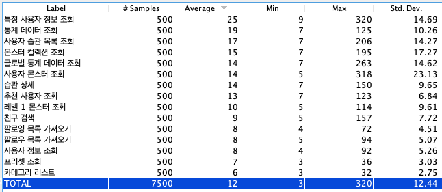

1. 스트레스 부하테스트 jmeter
2. 쿼리개선 QueryDsl
3. 코드품질 (수정됨)

---

- 성능 분석

  백엔드 팀은 서버 성능 개선을 위해서 부하 테스트를 진행했는데요.

  실제 사용중인 상황을 시뮬레이션 하기 위해 십만건 이상의 데이터를 테이블에 넣어놓고 
  Jmeter를 사용해서 테스트를 실행하고 결과를 도출하였습니다.

  이 중에서 저희는 평균 응답 시간이 오래걸리는 조회 API를 중점적으로 개선하였습니다.

  

- 문제 해결 ( N+1 )

  개선 방법 첫번째는 N+1 문제 해결입니다.

  테스트 중에 실제로 발생한 쿼리를 확인하여 N+1 문제가 발생하고 있는 쿼리는 QueryDSL의 fetchJoin을 사용하여 개선하였습니다.
  또는 추가적인 EntiryGraph 탐색이 필요치 않은 로직에 대해서는 QueryProjection을 사용하였습니다.

- 문제 해결 ( Full Table Scan )

  개선 방법 두번째는 MySQL의 explain을 사용해서 full table scan이 발생하는 쿼리를 찾은다음 인덱스를 생성해주거나 유니크 키를 달아서 해결하였습니다.

  또는 주로 같이 사용되는 컬럼들에는 복합 인덱스를 생성하였습니다.

- 결과

  결과적으로는 동일한 기준상에서 평균 응답속도를 보이는 사진과 같이 개선하였습니다.

---

## 성능 튜닝 결과

**기준**

- 사용자 수 약 10000명
- 테스트용 사용자의 완료 습관 수 10000개
- 테스트용 사용자의 현재 습관 수 10000개
- 테스트용 사용자의 몬스터 도감 수 3개
- 10개 스레드에서 동시에  모든 GET 요청에 대해 50회 씩 테스트 수행

**전체 튜닝 시작 전**

**성능 튜닝 이후**

5개 스레드에서 모든 GET 요청에 대해 100회씩 수행

