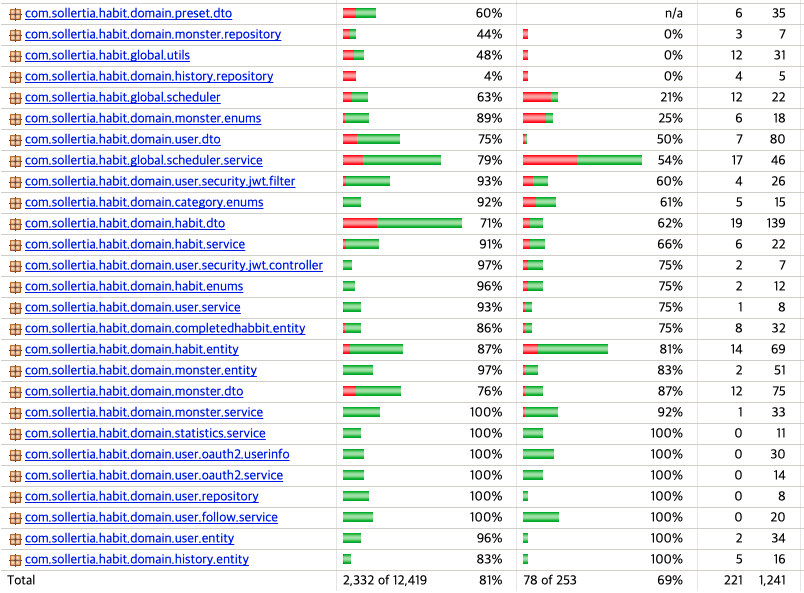
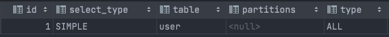

- 테스트 코드

  

  저희는 코드 변경에도 쉽게 검증할 수 있도록 테스트 코드를 작성하였습니다.
  모든 테스트는 given when then 패턴을 지켜가며 단위 테스트로 작성하였습니다.
  작성에 많은 시간을 투자한 만큼 리팩터링이나 트러블 슈팅에 많은 도움이 되었습니다.
  현재는 계획된대로 instruction coverage 80%를 만족합니다.

  
  

  

- 성능 분석

  백엔드 팀은 서버 성능 개선을 위해서 부하 테스트를 진행하였는데요.

  실제 사용중인 상황을 시뮬레이션 하기 위해 십만건 이상의 데이터를 테이블에 넣어놓고 
  Jmeter를 사용해서 테스트를 실행하고 결과를 도출하였습니다.

  이 중에서 저희는 평균 응답 시간이 오래걸리는 조회 API를 중점적으로 개선하였습니다.

  

- 문제 해결 ( N+1 )

  개선 방법 첫번째는 N+1 문제 해결입니다.

  테스트 중에 실제로 발생한 쿼리를 확인하여 N+1 문제가 발생하고 있는 API는 QueryDSL FetchJoin으로 개선하거나
  QueryProjection을 사용하여 Dto 클래스를 반환하도록하고 추가적인 Entity Graph 탐색이 불필요하도록 코드를 리팩토링하였습니다.

  

- 문제 해결 ( Full Table Scan )

  개선 방법 두번째는 MySQL의 explain을 사용해서 full table scan이 발생하는 쿼리를 찾은다음 인덱스를 생성해주거나 유니크 키를 달고 
  같은 쿼리에서 동시에 조건으로 사용되는 컬럼들에는 복합 인덱스를 생성하였습니다.

  

- 결과

  결과적으로 보이는 사진과 같이 동일한 기준에서의 평균 응답속도가 개선되었습니다.

---

## 성능 튜닝 결과

**기준**

- 사용자 수 약 10000명
- 테스트용 사용자의 완료 습관 수 10000개
- 테스트용 사용자의 현재 습관 수 10000개
- 테스트용 사용자의 몬스터 도감 수 3개
- 10개 스레드에서 동시에  모든 GET 요청에 대해 50회 씩 테스트 수행

**전체 튜닝 시작 전**

**성능 튜닝 이후**

5개 스레드에서 모든 GET 요청에 대해 100회씩 수행

