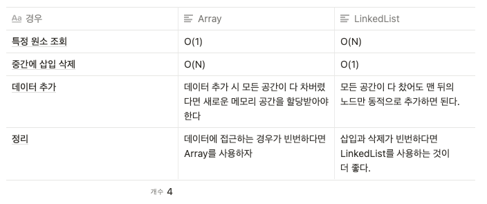

## 알고리즘 문제 풀기 with Python 

### Array vs Linked List




**Linked List 구현하기**

```python
class Node:
    def __init__(self, data):
        self.data = data
        self.next = None

class LinkedList:
    def __init__(self, data):
        self.head = Node(data)

    def append(self, data):
        if self.head is None:
            self.head = Node(data)
            return self.head
        node = self.head
        while node.next is not None:
            node = node.next
        node.next = Node(data)
        return node.next

    def print_all(self):
        node = self.head
        while node is not None:
            print(node.data)
            node = node.next

    def get_node(self, index):
        node = self.head
        for _ in range(index):
            node = node.next
        return node

    def add_node(self, index, data):
        new_node = Node(data)
        if index == 0:
            new_node.next = self.head
            self.head = new_node
            return
        else:
            node = self.get_node(index-1)
            next_node = node.next
            node.next = new_node
            new_node.next = next_node

    def delete_node(self, index):
        if index == 0:
            self.head = self.head.next
        else:
            node = self.get_node(index-1)
            node.next = node.next.next

my_list = LinkedList(4)
my_list.append(6)
my_list.append(8)
my_list.append(10)
my_list.append(12)

my_list.print_all()
print(my_list.get_node(2).data)

my_list.add_node(3, 9)
my_list.add_node(0, 1)
print('========')
my_list.print_all()

print('========')
my_list.delete_node(3)
my_list.delete_node(0)
my_list.delete_node(4)
my_list.print_all()
```


### 이진 트리

