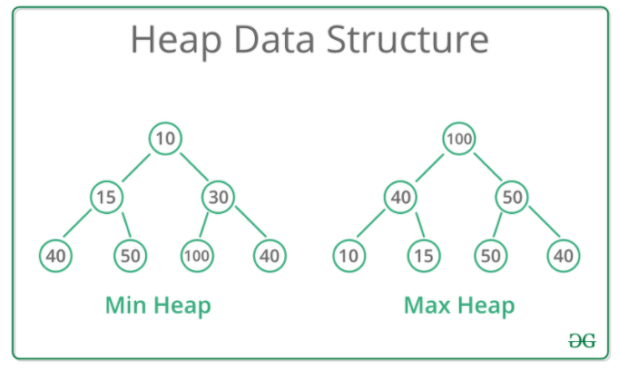

## 알고리즘 문제 풀기 with Python 

### 스택

Last In First Out

push(data) : 맨 위에 데이터 쌓기
pop() : 맨 위의 데이터 꺼내기
peek() : 맨 위의 데이터 보기
isEmpty() : 스택이 비어있는지 확인하기

**Linked List로 Stack 구현하기**

```python
class Node:
    def __init__(self, data):
        self.data = data
        self.next = None


class Stack:
    def __init__(self):
        self.head = None

    def push(self, value):
        new_node = Node(value)
        new_node.next = self.head
        self.head = new_node
        return

    def pop(self):
        if self.is_empty():
            return "Stack is Empty"
        node = self.head
        self.head = self.head.next
        return node

    def peek(self):
        if self.is_empty():
            return "Stack is Empty"
        return self.head

    def is_empty(self):
        return self.head is None

stack = Stack()
stack.push(1)
stack.push(2)
stack.push(3)
print(stack.is_empty())
print(stack.peek())
print(stack.pop())
print(stack.pop())
print(stack.pop())
print(stack.pop())
print(stack.is_empty())
```

Stack을 직접 구현해봤지만 python에서는 보통 list를 사용한다.

**top 문제**

```python
top_heights = [6, 9, 5, 7, 4]


 #
 #
 # #
## #
#####
#####
#####
#####
#####

def get_receiver_top_orders(heights):
    length = len(heights)
    result = [0] * length

    for i in range(length - 1):
        target = heights.pop()
        for j in range(len(heights)):
            if heights[len(heights) - 1 - j] >= target:
                result[length - 1 - i] = len(heights) - j
                break
    return result


print(get_receiver_top_orders(top_heights))  # [0, 0, 2, 2, 4] 가 반환되어야 한다!
```


### 큐

First In First Out

현실 세계의 대기열과 유사하다. (실제로 많은 대기열 시스템의 로직 구조가 큐로 되어있다.)

enqueue(data): 맨 아래에 데이터 추가하기
dequeue() : 맨 위의 데이터 추출하기
peek() : 맨 위의 데이터 보기
isEmpty() : 큐가 비어있는지 확인하기

**Linked List로 Queue 구현하기**

```python
class Node:
    def __init__(self, data):
        self.data = data
        self.next = None


class Queue:
    def __init__(self):
        self.head = None
        self.tail = None

    def enqueue(self, value):
        if self.is_empty():
            self.head = Node(value)
            self.tail = self.head
        else:
            new_node = Node(value)
            self.tail.next = new_node
            self.tail = new_node
        return

    def dequeue(self):
        if self.is_empty():
            return "Queue is Empty"
        else:
            node = self.head
            self.head = self.head.next
            return node.data

    def peek(self):
        if self.is_empty():
            return "Queue is Empty"
        else:
            return self.head.data

    def is_empty(self):
        return self.head is None


queue = Queue()
queue.enqueue(1)
queue.enqueue(2)
queue.enqueue(3)
queue.enqueue(4)
print(queue.is_empty())
print(queue.peek())
print(queue.dequeue())
print(queue.dequeue())
print(queue.dequeue())
print(queue.dequeue())
print(queue.dequeue())
print(queue.is_empty())
```


### 트리

계층형 비선형 자료구조
Queue, Stack : 선형 구조
선형 구조는 자료를 저장하고 꺼내는 것에 맞춰져 있고 비선형구조는 표현에 맞춰져 있다.

트리 용어

- Node : 트리에서 데이터를 저장하는 기본 요소
- Root Node : 트리의 맨 위에 있는 노드
- Level : 최상위 노드를 level 0으로 하였을 때, 하위 Branch로 연결된 노드의 깊이
- Parent Node : 어떤 노드의 하위 레벨에 연결된 노드
- Child Node : 어떤 노드의 상위 레벨에 연결된 노드
- Leaf Node(Terminal Node) : Child Node가 없는 노드
- Sibling : 동일한 Parent Node를 갖는 노드
- Depth : 트리에서 Node가 가질 수 있는 최대 level


https://planbs.tistory.com/entry/%EC%9E%90%EB%A3%8C%EA%B5%AC%EC%A1%B0-Tree%EC%99%80-Tree%EC%9D%98-%ED%91%9C%ED%98%84-%EB%B0%A9%EC%8B%9D


#### 이진 트리

이진 트리(Binary Tree)의 특징은 바로 각 노드가 최대 두 개의 자식을 가진다는 것. 
하위의 노드가 무조건 0, 1, 2 개만 있어야 한다.

```python
      o      Level 0 
    o o o    Level 1
   o  o  o   Level 2 # 이진 트리(X)

      o      Level 0 
    o   o    Level 1
   o o o     Level 2 # 이진 트리(O)
```


#### 완전 이진 트리

완전 이진 트리(Complete Binary Tree)의 특징은 바로 노드를 삽입할 때 최하단 왼쪽 노드부터 차례대로 삽입해야 한다는 것.

```python
      o      Level 0
    o   o    Level 1
     o o     Level 2  # -> 이진 트리 O 완전 이진 트리 X

      o      Level 0
    o   o    Level 1
   o o o     Level 2  # -> 이진 트리 O 완전 이진 트리 O
```


**완전 이진 트리를 배열로 표현하기**

트리는 클래스나 배열로 표현하는데, 특히 완전 이진 트리인 경우 배열로 표현할 수 있다.

```python
0번째 인덱스는 사용 X, 그래서 None 값을 배열에 넣고 시작.

      8      Level 0 -> [None, 8] 첫번째 레벨의 8을 넣고,
    6   3    Level 1 -> [None, 8, 6, 3] 다음 레벨인 6, 3을 넣고
   4 2 5     Level 2 -> [None, 8, 6, 3, 4, 2, 5] 다음 레벨인 4, 2, 5를 넣는다.
  
트리 구조 탐색하기

1. 현재 인덱스 * 2 -> 왼쪽 자식의 인덱스
2. 현재 인덱스 * 2 + 1 -> 오른쪽 자식의 인덱스
3. 현재 인덱스 // 2 -> 부모의 인덱스
```

**완전 이진 트리의 높이**

트리의 높이 : 루트 노드부터 가장 아래 리프 노드 까지의 길이

```python
      o      Level 0  # 루트 노드
    o   o    Level 1
   o o o     Level 2  # 가장 아래 리프 노드

이 트리의 높이는 ? 2 - 0 = 2! 
```

완전 이진 트리 k 레벨의 최대 노드 개수 = 2^k

높이가 h이면서 모든 노드가 꽉 차있는 완전 이진 트리의 모든 노드의 개수 = 2^0 + 2^1 + 2^2 + 2^3 +...+2^h
즉 `2^(h+1)-1 개`이다.

반대로 최대 개수가 N일때 최대 h는?`h = log2(N+1)-1`

그러므로 이진 트리의 높이는 최대 O(logN)


### 힙

최대값과 최소값을 빠르게 찾기 위해 고안된 완전 이진 트리

완전 이진 트리 : 마지막 레벨을 제외하고 모든 레벨이 완전히 채워져 있으며, 마지막 레벨의 모든 노드는 가능한 한 가장 왼쪽에 있다. 마지막 레벨 *h*에서 1부터 2*h*-1 개의 노드를 가질 수 있다.

최대값을 빠르게 찾기 위해서는 부모 노드의 값이 자식 노드의 값보다 크도록 한다.

```python
      8      Level 0
    6   3    Level 1
     2 1     Level 2  # -> 이진 트리 O 완전 이진 트리 X 이므로 힙이 아닙니다!

      8      Level 0
    6   3    Level 1  # -> 이진 트리 O 완전 이진 트리 O 인데 모든 부모 노드의 값이
   4 2 1     Level 2  # 자식 노드보다 크니까 힙이 맞습니다!


      8      Level 0
    6   3    Level 1  # -> 이진 트리 O 완전 이진 트리 O 인데 모든 부모 노드의 값이
   4 2 5     Level 2  # 자식 노드보다 크지 않아서 힙이 아닙니다..!
```





**힙의 규칙** : 힙은 항상 큰 값이 상위 레벨에 있고 작은 값이 하위 레벨에 있어야 한다.

**힙의 새로운 원소 추가 과정**

```python
이 맥스 힙에서 9를 추가해보겠습니다!
      8      Level 0
    6   3    Level 1  
   4 2 1     Level 2 

1. 맨 마지막에 원소를 넣습니다.

      8      Level 0
    6   3    Level 1  
   4 2 1 9   Level 2 

2-1. 부모 노드와 비교합니다. 3보다 9가 더 크니까! 둘의 자리를 변경합니다.

      8      Level 0
    6   3    Level 1  
   4 2 1 9   Level 2 

      8      Level 0
    6   9    Level 1  
   4 2 1 3   Level 2 

2-2. 다시 부모 노드와 비교합니다. 8보다 9가 더 크니까! 둘의 자리를 변경합니다.

      8      Level 0
    6   9    Level 1  
   4 2 1 3   Level 2 

      9      Level 0
    6   8    Level 1  
   4 2 1 3   Level 2 

3. 가장 위에 도달했으므로 멈춥니다. 힙의 특성을 그대로 유지해 데이터를 삽입했습니다!

      9      Level 0
    6   8    Level 1  
   4 2 1 3   Level 2
```


**힙 원소 추가 구현하기**

```python
class MaxHeap:
    def __init__(self):
        self.items = [None]

    def insert(self, value):
        self.items.append(value)
        index = len(self.items)-1

        while index > 1:
            if value > self.items[index//2]:
                self.items[index], self.items[index // 2] = self.items[index // 2], self.items[index]
                index = index // 2
            else:
                break
        return


max_heap = MaxHeap()
max_heap.insert(3)
max_heap.insert(4)
max_heap.insert(2)
max_heap.insert(9)
print(max_heap.items)  # [None, 9, 4, 2, 3] 가 출력되어야 합니다!
```

가장 오래걸리는 경우 완전 이진 트리의 최대 높이만큼 반복한다. 즉 힙 원소 추가의 시간 복잡도는 O(logN)이다.


**힙의 원소 제거 과정**

힙은 스택과 유사하게 맨 위에 있는 루트 노드만 제거할 수 있다.

```python
이 맥스 힙에서 원소를 제거해보겠습니다! (항상 맨 위의 루트 노드가 제거 됩니다.)
      8      Level 0
    6   7    Level 1  
   2 5 4 3   Level 2 

1. 루트 노드와 맨 끝에 있는 원소를 교체한다.

      8      Level 0
    6   7    Level 1  
   2 5 4 3   Level 2 

      3      Level 0
    7   6    Level 1  
   2 5 4 8   Level 2 

2. 맨 뒤에 있는 원소를 (원래 루트 노드)를 삭제합니다. 
이 값이 기존 맥스힙에 있던 가장 큰 값입니다. 따라서 이 값을 마지막에는 반환해줘야 합니다!

      3      Level 0
    6   7    Level 1  
   2 5 4 X   Level 2 

3-1. 변경된 노드를 더 큰 자식 노드와 비교해야 합니다. 
우선 부모와 왼쪽 자식을 비교합니다. 그리고 부모와 오른쪽 자식을 비교합니다.
그리고 부모 보다 큰 자식 중, 더 큰 자식과 변경해야 합니다.
왼쪽 자식인 6과 오른쪽 자식인 7 중에서 7이 더 크고, 부모인 3보다 크니까 둘의 자리를 변경합니다.

      3      Level 0
    6   7    Level 1  
   2 5 4     Level 2 

      7      Level 0
    6   3    Level 1  
   2 5 4     Level 2 

3-2. 다시 자식 노드와 비교합니다. 
우선 부모와 왼쪽 자식을 비교합니다.
왼쪽 자식인 4는 부모인 3보다 더 크니까 둘의 자리를 변경합니다.

      7      Level 0
    6   3    Level 1  
   2 5 4     Level 2 

      7      Level 0
    6   4    Level 1  
   2 5 3     Level 2 

4. 가장 아래 레벨에 도달했으므로 멈춥니다. 힙의 특성을 그대로 유지해 데이터를 삭제했습니다!

      7      Level 0
    6   4    Level 1  
   2 5 3     Level 2 

5. 그리고, 아까 제거한 원래 루트 노드, 8을 반환하면 됩니다!
```


**힙 원소 제거 구현하기**

```python
class MaxHeap:
    def __init__(self):
        self.items = [None]

    def insert(self, value):
        self.items.append(value)
        index = len(self.items)-1

        while index > 1:
            if value > self.items[index//2]:
                self.items[index], self.items[index // 2] = self.items[index // 2], self.items[index]
                index = index // 2
            else:
                break
        return

    def delete(self):
        self.items[1], self.items[-1] = self.items[-1], self.items[1]
        delete_node = self.items.pop()

        index = 1
        while index*2+1 < len(self.items):
            if self.items[index*2] > self.items[index*2+1]:
                if self.items[index] > self.items[index*2]:
                    break
                else:
                    self.items[index], self.items[index*2] = self.items[index*2], self.items[index]
                    index = index*2
            else:
                if self.items[index] > self.items[index*2+1]:
                    break
                else:
                    self.items[index], self.items[index*2+1] = self.items[index*2+1], self.items[index]
                    index = index*2+1
        return delete_node  # 8 을 반환해야 합니다.

max_heap = MaxHeap()
max_heap.insert(8)
max_heap.insert(6)
max_heap.insert(7)
max_heap.insert(2)
max_heap.insert(5)
max_heap.insert(4)
print(max_heap.items)  # [None, 8, 6, 7, 2, 5, 4]
print(max_heap.delete())  # 8 을 반환해야 합니다!
print(max_heap.items)  # [None, 7, 6, 4, 2, 5]
```

삭제도 입력과 마찬가지로 최악의 상황이 트리의 높이만큼 반복이므로 시간 복잡도 O(logN)이다.


---

**연습문제**

```python
s = "(())()"


def is_correct_parenthesis(string):
    stack = []
    for char in string:
        if char == '(':
            stack.append('(')
        else:
            if len(stack) > 0:
                stack.pop()
            else:
                return False
    if len(stack) == 0:
        return True
    else:
        return False


print(is_correct_parenthesis(s))  # True 를 반환해야 합니다!
```

